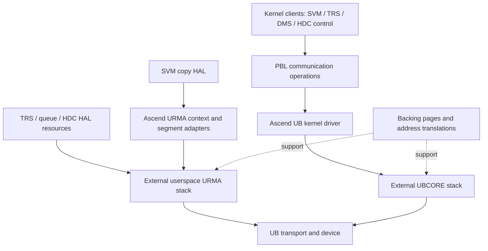
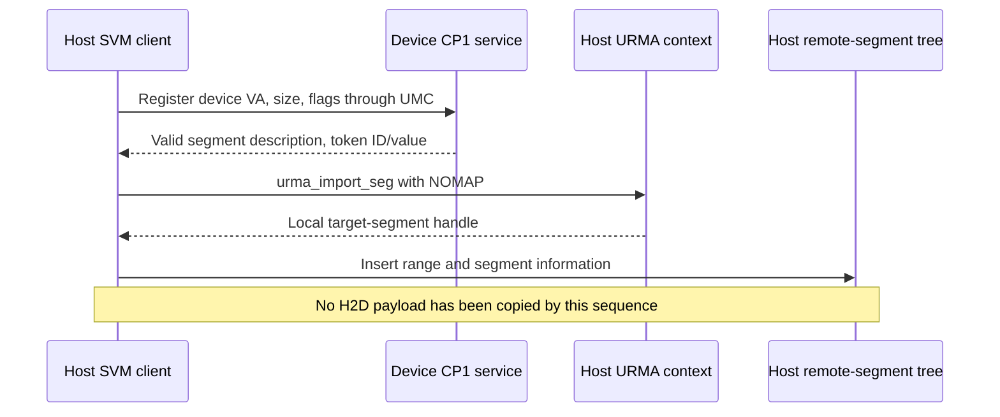

# 01 — UB transport, memory registration, and address mapping

[Summary](README.md) · Next: [Synchronous and asynchronous memcpy](02_sync_and_async_memcpy.md)

Source snapshot and evidence boundaries: [series scope](README.md#scope-and-evidence).
Deep dive: 2026-09-14, `driver` commit `866e409`. This chapter establishes the
resources used by paths P1–P10, using SVM's host implementation as the main
trace and identifying where the other subsystems use different resources.

Before an H2D transfer can run, software needs a transport endpoint, usable
memory descriptions, and a lifetime that keeps those resources valid until
completion. Creating any one of them does not create the others.

Reading map: [transport layers](#1-the-driver-has-userspace-and-kernel-submission-layers),
[device and channel setup](#4-svm-communication-setup),
[registration and import](#5-registering-local-and-remote-memory),
[UB address mapping](#6-ubmmubmem-address-mapping-is-a-separate-operation),
[lifetime and teardown](#8-resource-lifetime-and-teardown), and
[worked H2D example](#9-putting-the-resources-together-for-h2d).

## 1. The driver has userspace and kernel submission layers

SVM synchronous copying, normal TRS task submission, queue delivery, and HDC
normal sending build work requests in the HAL and call `urma_post_jfs_wr`.
Kernel message channels and registered-memory helpers call
`ubcore_post_jfs_wr`. These entry points distinguish the submission layers;
they do not imply that userspace operates without kernel-created resources.

The kernel's `g_ubdrv_ops` table supplies the UB implementations of common
messaging, dedicated channels, remote memory copy, segment registration/import,
RAO access, and device information. Higher-level modules reach it through PBL
communication wrappers. Userspace modules have their own communication state;
they do not all share one jetty or one completion queue.



This diagram shows software interfaces, not the full internal URMA-to-kernel
call graph. The external stack implements the resource creation and transport
details behind those interfaces. The local `ascend_urma_adapt` directory is an
adapter, not a complete URMA implementation.

Evidence: [kernel operation table](../../driver/src/sdk_driver/comm/ub/host/ascend_ub_main_adapt.c#L740),
[kernel SEND and READ/WRITE posting](../../driver/src/sdk_driver/comm/ub/common/ub_res/ascend_ub_jetty.c#L674),
[SVM userspace posting](../../driver/src/ascend_hal/svm/v3/urma_adapt/urma_jetty/svm_urma_jetty.c#L320).

## 2. Build selection and runtime selection both matter

| Component | Visible build selection | Runtime selector |
|---|---|---|
| SVM v3 copy | `ENABLE_UBE` includes the UB copy adapter alongside PCIe | `svm_ub_op_register` installs UB operations only for `HOST_DEVICE_CONNECT_TYPE_UB` |
| TRS | `ENABLE_UBE` plus `PRODUCT=ascend950` includes the master URMA implementations | Normal `halSqTaskSend` and `halAsyncDmaCreate` inspect connection type |
| Queue HAL | UB support requires `ascend950`, an `aarch64` build host, and `ENABLE_UBE` in the visible CMake | `que_clt_get_con_type` selects the UB client API |
| HDC HAL | The UB feature macro requires `ascend950`, `aarch64`, and `ENABLE_UBE` | `h2d_type` distinguishes UB from PCIe inside the transport branch |

These are the conditions in this source, rather than a claim that every
combination builds or is supported by a deployed product.

Evidence: [SVM build](../../driver/src/ascend_hal/svm/v3/op/svm_op.cmake#L24),
[SVM selector](../../driver/src/ascend_hal/svm/v3/op/ub_adapt/svm_ub_op.c#L22),
[TRS build](../../driver/src/ascend_hal/trs/dc/CMakeLists.txt#L31),
[TRS dispatch](../../driver/src/ascend_hal/trs/core/trs_interface.c#L1019),
[queue build](../../driver/src/ascend_hal/queue/dc/CMakeLists.txt#L10),
[HDC build](../../driver/src/ascend_hal/hdc/CMakeLists.txt#L51).

## 3. Resource vocabulary

The table describes how the types are used in this driver. It is not a complete
UB protocol specification.

| Resource | Role in the visible paths |
|---|---|
| URMA context | Binds userspace resources to a selected URMA device and EID index |
| EID | Endpoint identity carried in remote resource descriptions |
| JFS | Send work queue used to post SEND, READ, and WRITE requests |
| JFR / imported JFR | Receive resource or remote target used by these paths; a SEND consumes a posted receive buffer |
| JFC | Completion queue; polling, rearming, and event handling depend on the module |
| JFCE | Event object used to wait for completion-queue notification |
| Jetty / imported target | Communication endpoint state; code sometimes uses “jetty” for a group of JFS/JFR/JFC resources |
| Segment / target segment (`tseg`) | Registered or imported memory description referenced by a work request |
| SGE | Address, length, and segment reference describing a portion of a transfer |
| WR versus WQE | The C work-request description passed to URMA versus an engine queue entry; TRS can also construct a direct WQE. They are related representations, not interchangeable pointers. |
| UBA | Address allocated/exposed through the UB memory mapping path |

Token IDs, token values, device IDs, and UMMU translation identifiers occur in
different interfaces. Their names alone do not establish interchangeability.
For example, boot explicitly returns a UMMU-derived `tid` in a field named
`token_id`; URMA segment registration has its own token objects and fields.

Two pairs are particularly useful when reading the code:

| Pair | Distinction |
|---|---|
| Imported target endpoint versus imported target segment | The endpoint identifies where transport work is directed; the segment describes the memory that READ/WRITE can address. Importing a JFR does not register the payload buffer. |
| `urma_seg_t` versus `urma_target_seg_t *` | The former is a segment description that can be exchanged; the latter is a local handle returned by registration/import and referenced by SGEs. A host pointer to a handle is not sent as the remote memory address. |

SEND carries bytes into a peer's posted receive buffer. READ/WRITE instead
specify memory addresses and segments. Although the SVM copy WR contains a
target JFR handle, its payload is addressed by READ/WRITE SGEs; it should not
be described as a SEND of the payload into that JFR's receive buffer.
See [SVM WR construction](../../driver/src/ascend_hal/svm/v3/urma_adapt/urma_jetty/svm_urma_jetty.c#L269).

## 4. SVM communication setup

### Device opening runs registered lifecycle hooks

```text
svm_device_open_locked
  -> svm_ioctl_dev_init
     -> open SVM character device and record fd
     -> invoke device-init post-handlers in registration order
        -> install device information and UB operation tables
        -> initialize local segment managers
        -> initialize channels / reserved segments; register existing host memory
```

These are groups of hooks, not one hard-coded sequence of direct calls.
Constructors register them with explicit priority bands. Local segment-manager
setup uses priority 501; several upper-layer hooks use the default priority
65535. Ordering across different files within the same band is not guaranteed
by the source's priority contract. Device-uninit handlers run in reverse
registration order. This distinction matters when reasoning about startup
dependencies and cleanup.
See [device open](../../driver/src/ascend_hal/svm/v3/api/master/svm_master_init.c#L34),
[hook execution and fd lifecycle](../../driver/src/ascend_hal/svm/v3/sys_cmd/svm_ioctl.c#L163),
and [constructor-priority contract](../../driver/src/ascend_hal/svm/v3/inc/svm_init_pri.h#L15).

### Finding the local URMA context

The common adapter's constructor calls `urma_init`. Later,
`ascend_urma_ctx_get(devid)` lazily creates and caches a context under a lock.
For a UB-connected device, selection follows this chain:

```text
Ascend device ID
  -> query UB EID information through DMS/URD
  -> choose the reported local EID
  -> urma_get_device_by_eid(..., URMA_TRANSPORT_UB)
  -> find that EID's index on the URMA device
  -> urma_create_context(urma_device, eid_index)
```

The resulting context is a host-side URMA context associated with reaching
that Ascend device. The Ascend device number, local EID index, and remote EID
are different identifiers. The cache retains a reference, so a matching
`ascend_urma_ctx_put` does not normally delete the context after every use.
The adapter destructor releases cached contexts.
See [URMA initialization](../../driver/src/ascend_hal/comm/ascend_urma_adapt/ascend_urma_init.c#L16),
[UB selection](../../driver/src/ascend_hal/comm/ascend_urma_adapt/ascend_urma_dev.c#L25),
[DMS EID resolution](../../driver/src/ascend_hal/dms/ub/dms_ub_info.c#L95),
and [context ownership](../../driver/src/ascend_hal/comm/ascend_urma_adapt/ascend_urma_ctx.c#L40).

### Creating the SVM copy channels

`_svm_urma_master_dev_init` calls `svm_urma_chan_init` for UB. Channel setup first
creates the local pool, then requests and imports the remote endpoint.

| Object | Concrete SVM setup in this snapshot |
|---|---|
| Per-device pool | 32 `svm_urma_jetty` objects, semaphore initially 32 |
| Each object | Source/destination SGE arrays, WR array, completion-record array, JFCE, JFC, JFS, and JFR |
| Queue depth | 512 for each object's JFC/JFS/JFR configuration |
| JFS configuration | `URMA_TM_RM`, one SGE, middle priority, no inline payload |
| Completion notification | JFC is associated with JFCE and rearmed during creation |
| Remote target | One `g_tjfr[devid]` imported for use by the pool |

The pool creates these objects eagerly in a loop. A failure destroys the
objects already created. The `svm_urma_jetty` structure groups individual
JFS/JFR/JFC resources; this constructor does not call `urma_create_jetty`.
See [channel configuration](../../driver/src/ascend_hal/svm/v3/urma_adapt/urma_chan/svm_urma_chan.c#L24)
and [object and pool construction](../../driver/src/ascend_hal/svm/v3/urma_adapt/urma_jetty/svm_urma_jetty.c#L24).

For remote setup, SVM queries the device CP1 process identity/group through
APBI and sends `SVM_URMA_CHAN_AGENT_INIT_EVENT` through UMC. The reply supplies
the remote JFR ID and token value. The host builds an RM-mode `urma_rjfr_t`
and calls `ascend_urma_import_jfr`. The adapter selects plain `urma_import_jfr`
or the transport-path-aware variant under `SSAPI_USE_MAMI`.
See [remote setup and import](../../driver/src/ascend_hal/svm/v3/urma_adapt/urma_chan/svm_urma_chan.c#L50)
and [import adapter](../../driver/src/ascend_hal/comm/ascend_urma_adapt/ascend_urma_raw.c#L81).

```mermaid
sequenceDiagram
    participant H as Host SVM initialization
    participant U as Host URMA stack
    participant D as Device CP1 service
    H->>U: Get/create context; create local channel pool
    H->>D: UMC channel-init event
    D-->>H: Remote JFR ID and token value
    H->>U: Import remote JFR
    U-->>H: Host target-endpoint handle
    Note over H: Payload segments are established separately
```

The remote service's full construction is outside this checkout. The diagram
records the host request/reply contract, not a traced device implementation.

### Borrowing a channel and establishing reserved segments

`svm_urma_chan_alloc` waits for a pool slot using an untimed semaphore wait,
then chooses an idle object starting from a rotating index and marks it busy.
The borrowed object retains posted/acknowledged WR indices. Once the caller
has finished its transfer/wait work, `svm_urma_chan_free` resets those indices,
marks the object idle, and releases the semaphore. Freeing the slot does not
itself wait for outstanding transfers.
See [borrow/return](../../driver/src/ascend_hal/svm/v3/urma_adapt/urma_jetty/svm_urma_jetty.c#L200)
and [channel caller](../../driver/src/ascend_hal/svm/v3/urma_adapt/urma_chan/svm_urma_chan.c#L184).

Startup also attempts registration for the reserved SP range and existing VA
reservations, then records the device as valid. These helpers intentionally
return success even when the underlying registration is unsupported or fails.
Thus the valid-device flag does not establish that every reserved range has a
usable segment. Actual transfer-time segment lookup remains relevant.
See [reserved-range helpers](../../driver/src/ascend_hal/svm/v3/urma_adapt/urma_adapt_init/svm_urma_adapt_master_init.c#L33)
and [device initialization](../../driver/src/ascend_hal/svm/v3/urma_adapt/urma_adapt_init/svm_urma_adapt_master_init.c#L162).

## 5. Registering local and remote memory

### Ownership and the two manager layers

`svm_register_to_master(user_devid, dst_va, flag)` indexes an operation table by
both the memory user and its owner. Here `dst_va` is the range being registered;
it is not necessarily the destination of a later memcpy.

| Registration case | `user_devid` | `dst_va.devid` | Host-side result |
|---|---|---|---|
| Host buffer usable with device D | D | Host ID | Local URMA registration, recorded in `g_local_seg_mng[D]` |
| Device D memory usable from host | Host ID | D | Remote registration request and host import, recorded in `g_remote_seg_mng[D]` |
| Same owner and user | Same ID | Same ID | `SELF_USER` branch with separate handling |

For a UB connection, `svm_ub_share_register` installs both host/device
directions. It also installs the self-user operation. The UB adapter translates
access/pin flags and delegates to `svm_urma_register_seg`.
See [operation dispatch](../../driver/src/ascend_hal/svm/v3/share/register_to_master/svm_register_to_master.c#L24),
[UB table installation](../../driver/src/ascend_hal/svm/v3/share/ub_adapt/svm_ub_share.c#L23),
and [flag translation](../../driver/src/ascend_hal/svm/v3/share/ub_adapt/svm_ub_register_to_master.c#L19).

The two layers have different responsibilities:

| Layer | Owns and indexes |
|---|---|
| SVM client-segment manager | Per-device local/remote range trees; stores `tseg`, exchangeable segment, token ID/value, flags, and local reference count |
| Common Ascend URMA segment manager | Actual local registrations, original requested range, registration references, and a token pool |

On the host, `svm_urma_seg_get_user_devid` selects the first available working
URMA-capable device as the common local registration manager's context and
caches that choice. Consequently, two per-device SVM local records can refer
to the same lower-level host registration. A copy channel remains selected for
the transfer device; that is a different selection from this registration
manager. The code expresses this reuse policy, while the external platform
defines the applicable reachability and context compatibility.
See [host manager selection](../../driver/src/ascend_hal/svm/v3/urma_adapt/urma_seg_local/svm_urma_seg_local.c#L46)
and [SVM manager records](../../driver/src/ascend_hal/svm/v3/urma_adapt/urma_seg_mng/svm_urma_seg_mng.c#L28).

### Local host segment

```text
svm_register_to_master
  -> svm_ub_register_to_master
  -> svm_urma_register_seg
  -> svm_urma_register_seg_client
  -> svm_urma_register_seg_client_local
  -> svm_urma_seg_local_register
  -> ascend_urma_register_seg
  -> urma_register_seg
```

The common manager retains the original `(start, size)` for lookup and release,
but rounds the URMA registration outward to host pages:

```text
registered_va  = align_down(start, getpagesize())
registered_len = align_up(start + size, getpagesize()) - registered_va
```

| Setting in the common SVM registration adapter | Value |
|---|---|
| Default access | `URMA_ACCESS_READ` |
| Write-capable registration | READ, WRITE, and ATOMIC access bits |
| Caller requests pin | `non_pin = 0` |
| Caller does not request pin | `non_pin = 1` |
| Other address attributes | `dsva = 0`, `user_iova = 0`, `token_id_valid = 1` |
| Cacheability requested here | `URMA_CACHEABLE` |

The flags request transport access and pin behavior. `non_pin = 1` does not
mean that the backing memory can be freed during a transfer; its owning
allocator or another lifetime mechanism must still keep it usable. The
ATOMIC access bit permits that class of access in the registration; it does
not turn ordinary H2D WRITEs into atomic operations. Cacheability is likewise
not a complete coherency specification.
See [URMA configuration](../../driver/src/ascend_hal/comm/ascend_urma_adapt/ascend_urma_seg.c#L77).

### Range reuse and token ownership

An exact existing registration in the common manager increments its reference
count instead of calling `urma_register_seg` again. Different overlapping
logical ranges can return BUSY. Disjoint logical ranges whose rounded page
coverage overlaps take another branch: the adapter requests a freshly
allocated token rather than rejecting them solely for sharing a page. Thus
logical-range overlap and page-rounded overlap have different treatment.
See [range handling](../../driver/src/ascend_hal/comm/ascend_urma_adapt/ascend_urma_seg.c#L199).

The normal host manager and the separate self-user manager each configure a
token pool with 64 initial token objects, a cache threshold of 128, and up to
512 acquisitions per reused token. These are pool settings, not hardware-wide
segment limits. Each object contains an ID allocated with `urma_alloc_token_id`
and a token value obtained through the adapter's cached DMS query. Token ID and
token value are therefore distinct even when stored together.

On release, the acquisition count decreases. A zero-use token is freed when
the pool is at or above its cache threshold; otherwise it can remain cached.
Unregistering one segment consequently need not free its token ID immediately.
The fresh-token branch described above requests a new token for that
allocation; it does not establish that the token is forever excluded from
later pool reuse.
See [pool parameters](../../driver/src/ascend_hal/svm/v3/urma_adapt/urma_seg_local/svm_urma_seg_local.c#L23),
[token allocation](../../driver/src/ascend_hal/comm/ascend_urma_adapt/ascend_urma_token.c#L68),
[reuse and release](../../driver/src/ascend_hal/comm/ascend_urma_adapt/ascend_urma_token.c#L221),
and [token-value query](../../driver/src/ascend_hal/comm/ascend_urma_adapt/ascend_urma_raw.c#L32).

After local registration, SVM looks up the actual segment information and
inserts its per-device client record. If information lookup or client-record
insertion fails, the relevant path unregisters the acquired local reference.
Repeated local client records carry references; repeated remote records are
rejected by the client manager. They are not a single uniform segment cache.
See [local client](../../driver/src/ascend_hal/svm/v3/urma_adapt/urma_seg_register_client/svm_urma_seg_register_client.c#L85)
and [client insertion](../../driver/src/ascend_hal/svm/v3/urma_adapt/urma_seg_mng/svm_urma_seg_mng.c#L75).

The UB register wrapper retries BUSY only for host-owned ranges, sleeping
100 ms between attempts with a 10,000-attempt cap. It also translates
NOT_SUPPORT to success. This wrapper is compatibility-oriented: success here
must be interpreted alongside the later segment lookup, rather than assumed
to guarantee a newly created transport resource. Neither this retry limit nor
the channel's completion timeout defines a single whole-copy deadline.
See [registration retry wrapper](../../driver/src/ascend_hal/svm/v3/share/ub_adapt/svm_ub_register_to_master.c#L30).

### Remote device segment

For device-owned memory, the host does not register the numeric device VA as
host backing memory. It queries CP1 through APBI and sends
`SVM_URMA_SEG_REGISTER_EVENT`, containing VA, size, and flags, through UMC. A
valid reply supplies `urma_seg_t`, token ID, and token value. An invalid reply
is reported as NOT_SUPPORT by this client.

For the ordinary cross-device case, the host imports that description in its
context for device D, then records the handle in `g_remote_seg_mng[D]`. The
import requests READ/WRITE/ATOMIC access, non-cacheable behavior, and
`URMA_SEG_NOMAP`. It provides a transport handle without creating an ordinary
host CPU mapping for the device VA.



If import fails after remote registration, the host requests remote
unregistration. If client-tree insertion fails, it invokes the client cleanup
path. Normal remote unregister first releases the host import, then sends
`SVM_URMA_SEG_UNREGISTER_EVENT`; a missing device process is treated as already
gone for that cleanup request.
See [remote request/reply](../../driver/src/ascend_hal/svm/v3/urma_adapt/urma_seg_register_client/svm_urma_seg_register_client.c#L23),
[import flags](../../driver/src/ascend_hal/svm/v3/urma_adapt/urma_seg_register_client/svm_urma_seg_register_client.c#L118),
and [remote lifecycle](../../driver/src/ascend_hal/svm/v3/urma_adapt/urma_seg_register_client/svm_urma_seg_register_client.c#L189).

`SELF_USER`, set when user and owner IDs match, is a separate branch. It skips
the cross-device client-tree insertion and, for remote requests, skips host
import. The local adapter selects the self-user manager and maps this flag to
the token-policy option without a token value. This branch should not be used
as the model for the normal host/device pair above.
See [self-user manager selection](../../driver/src/ascend_hal/svm/v3/urma_adapt/urma_seg_local/svm_urma_seg_local.c#L77)
and [flag adapter](../../driver/src/ascend_hal/svm/v3/urma_adapt/inc/svm_urma_to_ascend_flag.h#L19).

### Managed host memory and the TRS bridge

`svm_host_register.c` connects allocator lifetime to registration:

| Trigger | Registration behavior |
|---|---|
| Enable registration for a device | Visits existing eligible host allocations, VMM segments, and allocation-cache ranges |
| Copy-capable normal host allocation | Post-allocation hook attempts registration for each enabled device |
| Normal host free | Pre-free hook releases the corresponding registration references |
| Copy-capable host VMM map | Registers the mapped segment; returns a failure and unwinds earlier device registrations if needed |
| VMM unmap / device disable | Releases registrations through the relevant hooks |

The normal allocation hook is `void` and ignores registration return values;
the VMM map hook returns an error. Therefore allocator-hook installation does
not prove that every host allocation obtained every possible registration.
Existing allocation and cache handling also means that physical registration
lifetime need not match the lifetime of a single logical allocation request.
See [enable and allocation hooks](../../driver/src/ascend_hal/svm/v3/api/master/svm_host_register.c#L132)
and [VMM hooks](../../driver/src/ascend_hal/svm/v3/api/master/svm_host_register.c#L203).

TRS obtains segment descriptions using `halMemGetSeg`. This helper requires
the VA to be in the SVM range and checks consistency if it crosses allocation
properties: segment, token, and owning device must match. This is a stronger
condition than merely accepting an arbitrary host pointer. For a host range,
it looks in the client tree indexed by the requested device; for a device
range, it looks in that owner's remote tree. It returns a segment description
and token value, not an extra registration reference.

Likewise, `svm_urma_get_tseg` returns the stored handle under a lookup lock;
it does not increment an in-flight-transfer reference. The allocation,
registration, and transfer owners must maintain the required lifetime. See
document 02 for how synchronous copies wait before releasing temporary memory.

Evidence: [host registration hooks](../../driver/src/ascend_hal/svm/v3/api/master/svm_host_register.c),
[TRS segment bridge](../../driver/src/ascend_hal/svm/v3/api/master/svm_get_urma_seg.c#L23),
[handle lookup](../../driver/src/ascend_hal/svm/v3/urma_adapt/urma_seg_mng/svm_urma_seg_mng.c#L186).

### Other subsystems and kernel registrations

The detailed SVM cache policy above is not universal across HAL. TRS registers
its SQ source buffer and imports device queue segments; HDC registers its
session buffers; queue delivery has its own transaction memory manager.
Their ownership and completion rules are covered in chapters 03 and 04.

Kernel clients use PBL segment operations instead of these userspace managers.
`ubdrv_register_seg` builds a `ubcore_seg_cfg` from the kernel caller's VA,
length, access bits, and token value, then calls `ubcore_register_seg` with the
kernel path's non-pin setting. `ubdrv_import_seg` imports the peer's segment
description and token through `ubcore_import_seg`. Unregister and unimport
have separate matching wrappers. This is a parallel kernel API family, not a
call from `urma_register_seg` into this particular SVM manager.
See [kernel registration and import](../../driver/src/sdk_driver/comm/ub/common/msg/ascend_ub_urma_chan.c#L580).

## 6. UBMM/UBMEM address mapping is a separate operation

The host mapping path makes this progression:

```text
host VA and process
  -> acquire backing pages
  -> build/merge physical segments
  -> allocate UBA
  -> map UBA to those physical segments through an IOMMU domain
  -> encode the UB memory ID and offset for the sharing protocol
```

`ubmm_map_host_pa_get` obtains pages through `svm_get_user_pages`, converts them
to physical segments, merges consecutive regions, and retains the page list
for release. `ubmm_map_uba` caches mapping nodes and reference counts, allocates
the UBA, and calls into PBL UBMM. `_ubmm_map` installs the physical mappings
using `ka_mm_iommu_map`; initialization obtains the UB translation device from
the configured `UB_TID`.

`ubmem_map_local_client` combines the resulting UBA with the host memory ID and
UBA base to form the exported address representation. The remote client uses
SVM kernel messages for the other side. `ubmem_map_client` checks capability
first and returns a zero updated address when UB memory mapping is unsupported.

CASM's UB adapter pins the source before requesting this mapping and releases
that pin when no mapping was created or when the mapping is removed. The
UBDEVSHM adapter separately publishes segment acquisition/release callbacks
and returns VA, size, token ID, and EID information to the external framework.

The mapping cache is scoped through a context for `(udevid, tgid)`. A repeated
mapping reuses a node and increments its reference count. The returned UBA
includes the caller VA's offset within the first page. On the last unmap, the
normal path removes the IOMMU mapping, releases backing-page references, frees
the UBA allocation, and removes the node. Task recycling has a separate walk
over remaining mappings.

UBMEM then exports an address encoded from the host's `UB_MEM_ID` and the
offset `uba - uba_base`. This is a different address representation from both
the original process VA and a `urma_target_seg_t *`. The PBL mapping layer
obtains its translation device using the platform's `UB_TID` and installs
READ/WRITE IOMMU mappings.

| Operation | Produces | Does it move the requested payload? |
|---|---|---|
| Local URMA registration | Transfer segment and token information | No |
| Remote URMA segment import with NOMAP | Host transfer handle for peer memory | No |
| UBMM/UBMEM mapping | UBA translation and encoded shared address | No |
| URMA WRITE / device READ | Data transfer using prepared resources | Yes, when executed |
| CPU copy through an eligible load/store mapping | CPU accesses through the mapping | Yes |

These functions establish addressability and lifetime. Device consumption,
access ordering, and exact coherency guarantees require the corresponding
device and platform evidence. In particular, the explicit UBMM IOMMU mapping
must not be described as the proven internal implementation of every URMA
registration: the latter crosses an external API boundary.

Evidence: [page acquisition](../../driver/src/sdk_driver/svm/v3/ubmm/ubmm_core.c#L60),
[UBA mapping lifecycle](../../driver/src/sdk_driver/svm/v3/ubmm/ubmm_core.c#L208),
[IOMMU mapping](../../driver/src/sdk_driver/pbl/ubmm/ubmm_map.c#L132),
[UBMEM address construction](../../driver/src/sdk_driver/svm/v3/ubmem_adapt/client/ubmem_client.c#L54),
[CASM adapter](../../driver/src/sdk_driver/svm/v3/casm_adapt/ubmem/casm_ubmem.c#L22),
[UBDEVSHM callbacks](../../driver/src/sdk_driver/svm/v3/pma_ub/pma_ub_ubdevshm_wrapper.c#L122),
[UBA offset and unmap](../../driver/src/sdk_driver/svm/v3/ubmm/ubmm_core.c#L318),
[translation-device initialization](../../driver/src/sdk_driver/pbl/ubmm/ubmm_map.c#L50).

## 7. CPU access and prefetch need capability-specific interpretation

`halSvmAccess` checks whether an SVM address belongs to the requested device
and advertises load/store capability. If so, `svm_access_direct` performs a
CPU copy. Otherwise, the function routes through `svm_access_by_dma`, which
ultimately calls the selected synchronous copy implementation. Small ordinary
host buffers can be staged, while other buffers may need registration.

This establishes a conditional access route. It does not show that every
device allocation is CPU-addressable on a UB system.

Likewise, the visible v3 `drvMemPrefetchToDevice` path tracks missing mapped
ranges and calls `svm_smm_client_map`. Its name alone is insufficient evidence
of a separate host-issued bulk-copy engine. The device mapping implementation
would be needed to claim any additional migration behavior.

Evidence: [access dispatch](../../driver/src/ascend_hal/svm/v3/api/master/svm_register_access.c#L597),
[prefetch segment mapping](../../driver/src/ascend_hal/svm/v3/api/master/svm_prefetch.c#L300).

## 8. Resource lifetime and teardown

There are several independent forms of lifetime tracking:

| Resource | What keeps it alive or available | What release means |
|---|---|---|
| Cached Ascend URMA context | Cache reference plus temporary `get` references | `put` releases a temporary reference; adapter shutdown releases the cache |
| Borrowed SVM channel | Semaphore slot and BUSY state | Return makes it reusable and resets counters; it is not a transfer wait |
| SVM local client record | Registration references for that user device | Each unregister releases the corresponding lower-level reference |
| Actual host segment | Common manager's registration references | Last release calls `urma_unregister_seg` and releases its token acquisition |
| Remote segment | Device registration plus host import and client record | Remove client record, unimport, then request remote unregister |
| Token object | Pool acquisition count and caching policy | May be cached after its last current segment is released |
| UBMM node | Mapping references and retained backing pages | Last unmap removes translation and releases pages/address allocation |
| In-flight data operation | Subsystem/caller completion discipline | Completion must establish when buffers and referenced resources can be reused |

The registration reference counts in this table count registrations. They do
not count every WR that looks up the segment. `halMemGetSeg` and
`svm_urma_get_tseg` therefore need an existing lifetime owner around their
returned information. A valid segment handle establishes addressability, not
completion of work using it.

For local unregister, the common manager requires the original logical range.
If its reference count is greater than one, it only decrements the count.
Otherwise it removes the range, unregisters the URMA segment, and releases
the token acquisition. The SVM layer can recover an omitted size from a
record at the range's starting address before invoking this path.
See [common unregister](../../driver/src/ascend_hal/comm/ascend_urma_adapt/ascend_urma_seg.c#L265)
and [SVM unregister](../../driver/src/ascend_hal/svm/v3/urma_adapt/urma_seg_mng/svm_urma_seg_mng.c#L298).

At device close, SVM occupies its pipeline, recycles device-associated
resources, and invokes the uninit handlers before closing the fd. The hooks
release that device's host registration references, remove reserved remote
segments, tear down its copy channels, and recycle remaining remote segment
records. The framework reverses hook registration order; the remote-record
recycle hook is registered early so it runs after the reserved-range cleanup.
See [device close](../../driver/src/ascend_hal/svm/v3/api/master/svm_master_init.c#L56),
[host registration disable](../../driver/src/ascend_hal/svm/v3/api/master/svm_host_register.c#L160),
and [remaining remote-segment recycling](../../driver/src/ascend_hal/svm/v3/urma_adapt/urma_seg_mng/svm_urma_seg_mng.c#L417).

This is not simply “delete every URMA object when one device closes.” The
common local manager's host-side ordinary device-uninit path preserves its
shared state, and the common URMA context is cached. There are also explicit
CRIU reset paths: channel destruction skips some ordinary URMA delete calls
while resetting, and the local-manager reset clears its cached selection and
destroys initialized managers. Those branches require their own lifecycle
context and should not be presented as normal transfer completion handling.
See [local manager uninit/reset](../../driver/src/ascend_hal/svm/v3/urma_adapt/urma_seg_local/svm_urma_seg_local.c#L224)
and [channel teardown](../../driver/src/ascend_hal/svm/v3/urma_adapt/urma_jetty/svm_urma_jetty.c#L136).

## 9. Putting the resources together for H2D

Consider a normal synchronous copy from managed host range H to device range
D on device 0. Assume both registrations are available and H fits a single
segment; chapter 02 covers staging, temporary registration, and slicing.

```text
Host application memory H                     Device application memory D
        |                                               |
local URMA registration                       remote registration service
        |                                               |
g_local_seg_mng[0]                             g_remote_seg_mng[0]
        |                                               |
source SGE: H + local tseg                     destination SGE: D + imported tseg
        \                                               /
         +--------- host WRITE work request -----------+
                          |
             borrowed g_chan_inst[0] channel
                          |
              imported endpoint g_tjfr[0]
                          |
                 UB transfer, then JFC wait
```

`svm_ub_copy_urma_tseg_get` selects the local record using the peer device ID
and the remote record using the memory owner's ID. `svm_urma_chan_submit`
combines those handles and addresses with the selected target endpoint. Its
JFS posting and completion handling finally perform and observe the copy.
After completion, returning the channel does not unregister persistent
application allocations; their allocator/registration hooks own that lifetime.
See [source/destination lookup](../../driver/src/ascend_hal/svm/v3/op/ub_adapt/svm_ub_memcpy.c#L52)
and [combining handles into submission](../../driver/src/ascend_hal/svm/v3/urma_adapt/urma_chan/svm_urma_chan.c#L199).

For asynchronous H2D, the source/destination ownership is the same but the
transport initiator changes. TRS prepares a device READ of the registered host
source. It obtains segment/token descriptions through the SVM bridge and
uses its own execution resources; it does not simply borrow this host SVM
copy channel and defer the wait.
See [async direction and preparation](02_sync_and_async_memcpy.md#4-trs-asynchronous-copy-preparation).

For source-level debugging, locate the earliest missing prerequisite before
attributing a failure to the link:

| Stage | Evidence to inspect |
|---|---|
| Device/context selection | UB connection type, DMS EID result, context creation result |
| Channel setup | Local resource creation, CP1 identity, channel-init reply, imported endpoint |
| Host registration | Correct per-device client record, underlying manager, original range and flags |
| Device registration | Remote reply validity, segment description, host import and tree insertion |
| Transfer preparation | Successful range lookup and correct source/destination segment roles |
| Completion and reuse | The owning subsystem's wait or task completion, followed by matching releases |

This is a code-reading guide, not a hardware test result. The remaining
external questions are the concrete UMMU/UDMA translation and coherency rules,
the complete device handlers, runtime buffer-reuse decisions, and measured
resource costs. The repository's
[UBDEVSHM dependency file](../../driver/cmake/third_party/ubdevshm.cmake#L12)
also shows that part of the memory stack is supplied externally.
