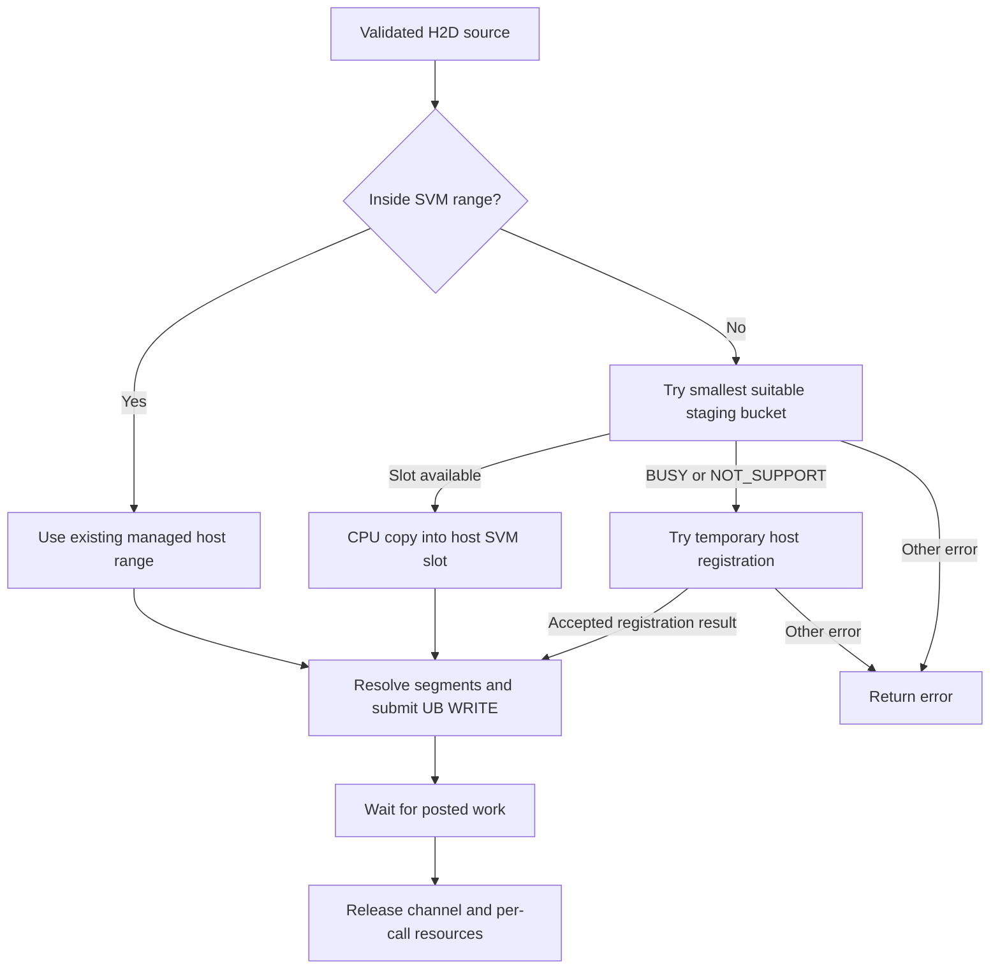
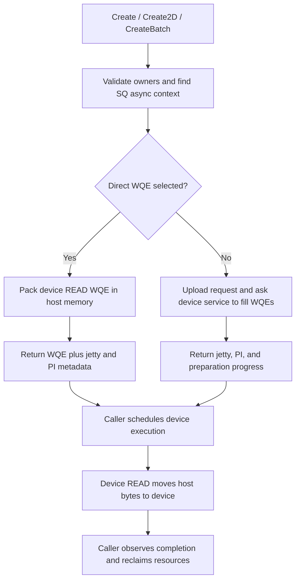

# 02 — Synchronous and asynchronous H2D memcpy over UB

[Summary](README.md) · Previous: [Transport and memory](01_transport_and_memory.md) · Next: [TRS submission](03_trs_task_and_args_submission.md)

Source snapshot and evidence boundaries: [series scope](README.md#scope-and-evidence).
This chapter expands P1 and P2 from API entry through buffer selection, work
preparation, completion, and cleanup. The scope is the host driver/HAL source;
execution inside device firmware remains outside this trace. The upper
ACL/runtime caller is connected in [document 06](06_acl_runtime_dispatch.md).
Task-argument uploads use P4 and are covered in document 03.

## 1. The decisive difference is the transfer initiator

**Synchronous H2D copies post a host-issued URMA WRITE and wait. TRS async H2D
copies prepare device-issued URMA READ work for later execution.** Both move
host bytes into device memory, but their resource ownership and return values
have different meanings.

| Property | SVM synchronous copy | TRS stream-oriented asynchronous copy |
|---|---|---|
| HAL entry | `drvMemcpy`; ordinary `halMemcpy` with `info == NULL` | `halAsyncDmaCreate`, alias `halAsyncDmaWqeCreate`, and related interfaces |
| H2D operation | Host-issued URMA WRITE | Work prepared for device-issued URMA READ |
| Submission responsibility | Host SVM borrows a copy channel and posts work | Host TRS prepares work; caller/task scheduling triggers execution |
| Host memory | Existing SVM segment, staging pool, or temporary registration | Valid segment information obtained through SVM |
| Successful return | Transfer wait has completed | Preparation has completed; payload execution is separate |
| Cleanup | Return channel; release temporary registration or staging slot | Caller destroys/recycles WQE storage or supplies a consumer index |

The opcode is explicit in `svm_cpy_dir_to_urma_opcode`,
`trs_get_async_urma_opcode`, and `trs_get_async_dwqe_opcode`. For async H2D,
TRS places the device destination in the engine-local address field and the
host source in the remote address field. Internal names such as `send_addr`
and `recv_addr` must be read in that engine context.

Evidence: [SVM opcode](../../driver/src/ascend_hal/svm/v3/op/ub_adapt/svm_ub_memcpy.c#L47),
[TRS opcode](../../driver/src/ascend_hal/trs/core/urma/master/trs_master_async.c#L309),
[TRS address roles](../../driver/src/ascend_hal/trs/core/urma/master/trs_master_async.c#L121).

The public names alone do not identify the implementation:

| API family | UB behavior covered here |
|---|---|
| `drvMemcpy`, ordinary `halMemcpy` | SVM synchronous copy |
| `halMemcpy2D` with synchronous copy type; `halMemcpyBatch` | Rows/elements reuse the SVM WRITE-and-wait transport |
| Older SVM async and DMA descriptor APIs | UB operation-table hooks are absent; see section 3 |
| `halAsyncDmaCreate*`, `halAsyncDmaWqeCreate` | Prepare work using an SQ-associated TRS async context |
| `halAsyncDmaJettyCreate/Query/Destroy`, `halAsyncDmaWqeConvert`, `halAsyncDmaJettyWqeFill` | Separate jetty lifetime, caller-owned WQE conversion, and queue upload |

Evidence: [SVM 2D dispatch](../../driver/src/ascend_hal/svm/v3/api/master/svm_cpy.c#L1227),
[TRS create dispatch](../../driver/src/ascend_hal/trs/core/trs_interface.c#L536),
[jetty and conversion APIs](../../driver/src/ascend_hal/trs/core/trs_interface.c#L841).

## 2. Synchronous H2D: API to transport

### Validation and operation selection

```text
drvMemcpy
  -> drvMemcpyInner
  -> check copy capability and derive source/destination owners
  -> svm_memcpy_sync
  -> svm_mem_sync_copy
  -> svm_mem_sync_copy_h2d
       -> optional host staging pool
       -> otherwise _svm_mem_sync_copy, with registration when needed
  -> svm_sync_copy
  -> g_copy_ops[device].sync_copy
  -> svm_ub_sync_copy
       -> svm_urma_chan_alloc
       -> svm_ub_async_copy
       -> svm_urma_chan_wait
       -> svm_urma_chan_free
```

`drvMemcpyInner` checks pointers and destination capacity, then handles a
zero-length copy. For a nonempty copy it checks `SYNC_COPY` capability and
constructs source/destination ownership information. SVM ranges crossing
allocation properties must have compatible properties and the same owner.
The direction is derived from those owners, and H2D selects the destination
device's copy implementation.

Ordinary `halMemcpy(..., info == NULL)` converges on `svm_mem_sync_copy`.
Its non-null `info` branch has a special D2H role in this snapshot. Also,
`svm_memcpy_sync` has a shared-address-resolution branch gated specifically
on a PCIe connection; that branch is not part of this UB trace. This gate
alone does not describe all UB IPC/VMM capabilities.

The internal name `svm_ub_async_copy` means it posts work before the enclosing
synchronous operation waits. It is not the public stream-copy API.

Evidence: [range/capability checks](../../driver/src/ascend_hal/svm/v3/api/master/svm_cpy.c#L101),
[drvMemcpy](../../driver/src/ascend_hal/svm/v3/api/master/svm_cpy.c#L627),
[halMemcpy](../../driver/src/ascend_hal/svm/v3/api/master/svm_cpy.c#L738),
[shared-resolution gate](../../driver/src/ascend_hal/svm/v3/api/master/svm_cpy.c#L191),
[copy operation dispatch](../../driver/src/ascend_hal/svm/v3/op/memcpy/svm_memcpy.c#L89).

### Choosing the host buffer



For ordinary host memory outside the SVM range,
`svm_mem_sync_copy_h2d_by_pool` obtains a slot, copies the source bytes into it
with a CPU copy, and passes the slot's host SVM address to `svm_sync_copy`.
It returns the slot on both success and error.

| Staging slot size | Slot count |
|---|---|
| 128 bytes | 10,000 |
| 4 KiB | 1,000 |
| 512 KiB | 8 |

These are three process-local, mutex-protected buckets. Selection chooses the
smallest bucket that can contain the entire request. If that bucket is full,
there is no search for a free slot in a larger bucket. Requests larger than
512 KiB cannot use this pool.

The host-device initialization hook allocates the buckets as host SVM memory.
Partial initialization can leave only some buckets usable. Slot acquisition
requires the pool to be ready; it does not allocate a bucket on demand or wait
for another copy to return a slot. The hook tolerates pool initialization
failure, allowing copies to use the fallback path.

Only `DRV_ERROR_BUSY` and `DRV_ERROR_NOT_SUPPORT` from the pool attempt cause
that fallback. A CPU-copy or transport error from an acquired slot propagates
instead of retrying the transfer with another buffer.

Evidence: [pool copy and release](../../driver/src/ascend_hal/svm/v3/api/master/svm_cpy.c#L45),
[buckets and selection](../../driver/src/ascend_hal/svm/v3/api/master/svm_cpy_host_pool.c#L24),
[pool initialization](../../driver/src/ascend_hal/svm/v3/api/master/svm_cpy_host_pool.c#L116),
[slot acquisition and lifecycle hooks](../../driver/src/ascend_hal/svm/v3/api/master/svm_cpy_host_pool.c#L196),
[fallback decision](../../driver/src/ascend_hal/svm/v3/api/master/svm_cpy.c#L486).

### Temporary registration versus existing registration

The fallback `_svm_mem_sync_copy` calls `svm_register_to_master` when the host
range is outside SVM and the connection is non-PCIe. For H2D, the flags request
pinning and read access to the host source. A successful registration result
sets a per-call flag; after the copy, that flag controls the matching
`svm_unregister_to_master` call.

This wrapper also tolerates registration results `NOT_SUPPORT` and `BUSY` and
continues to copy without setting that flag. These branches are not evidence
that an unregistered range can always transfer: lower segment lookup must
still succeed. The UB registration adapter itself handles retries and return
translation, as described in
[document 01](01_transport_and_memory.md#5-registering-local-and-remote-memory).

Existing host SVM memory bypasses this temporary-registration branch. Its
allocation/registration lifecycle supplies the segment state used by copy.
A range being managed does not by itself prove every registration hook
succeeded; the actual lookup remains decisive.

Evidence: [temporary registration and release](../../driver/src/ascend_hal/svm/v3/api/master/svm_cpy.c#L448),
[managed-memory registration](01_transport_and_memory.md#managed-host-memory-and-the-trs-bridge).

### Two stages of splitting

The UB adapter first resolves source and destination target-segment handles
for the device using the copy channel. For H2D, that device is the destination
owner. Both handles are needed for the source and destination SGEs.

There are two independent splitting rules:

| Stage | Reason | Result |
|---|---|---|
| Host allocation-property slicing | A host SVM/VMM range spans different allocation properties | Submit each host subrange with the corresponding segment, advancing the device address by the same byte offset |
| Transport work construction | Limit the bytes represented by one work request | Split each submitted subrange into chunks of at most `0x10000000`, or **256 MiB** |

The first rule inspects the host range. It should not be generalized into an
arbitrary source-and-destination scatter/gather walker. The second constructs
a linked list of WRs, each with one source SGE, one destination SGE, the H2D
WRITE opcode, a completion request, and placement/completion ordering flags.

The SVM channels described in document 01 have depth 512, with one slot kept
unused by the ring-accounting rule. Before posting a chain, the helper checks
that enough work slots are available. `svm_urma_chan_submit` waits for one
completion and retries on `BUSY`. This is capacity management for a submitted
chain; the 256 MiB chunk constant is not a promise of unlimited per-call size.

Evidence: [segment lookup and host slicing](../../driver/src/ascend_hal/svm/v3/op/ub_adapt/svm_ub_memcpy.c#L52),
[work construction and posting](../../driver/src/ascend_hal/svm/v3/urma_adapt/urma_jetty/svm_urma_jetty.c#L263),
[channel retry](../../driver/src/ascend_hal/svm/v3/urma_adapt/urma_chan/svm_urma_chan.c#L199),
[channel construction](01_transport_and_memory.md#creating-the-svm-copy-channels).

### Completion and failure semantics

The successful path waits for every outstanding WR on the borrowed channel.
In the normal hardware build, each iteration waits for a JFC event, verifies
the returned JFC, polls one completion record, checks its status, acknowledges
and rearms the JFC, and advances the acknowledged-work index.

| Waiting point | Behavior visible in the source |
|---|---|
| Borrowing a copy channel | Uses the untimed channel-allocation form; this wait has no 60-second API deadline |
| Insufficient posting slots | Waits for one WR completion, then retries the submission |
| Final transfer wait | Iterates over outstanding work and passes 60,000 ms to each event wait |
| Interrupted underlying event wait | The URMA wrapper retries `EINTR` using the remaining time for that individual wait |

Consequently, **60 seconds is not a total `drvMemcpy` deadline**. Channel
acquisition, repeated progress waits, and the final sequence of completion
waits all contribute to the call duration. Emulation guards also remove some
hardware wait/poll checks; source-level emulation is not transport validation.

On a posting error, `svm_ub_sync_copy` attempts to drain outstanding work,
releases the channel, and returns the original posting error. It ignores the
result of that drain attempt. A final-wait error also releases the channel and
returns an error. Neither error path establishes that the whole transfer
completed or that the destination remains unchanged. There is no rollback of
bytes already copied.

Evidence: [sync success and error paths](../../driver/src/ascend_hal/svm/v3/op/ub_adapt/svm_ub_memcpy.c#L165),
[channel allocation and retry](../../driver/src/ascend_hal/svm/v3/urma_adapt/urma_chan/svm_urma_chan.c#L184),
[completion loop](../../driver/src/ascend_hal/svm/v3/urma_adapt/urma_jetty/svm_urma_jetty.c#L355),
[interrupted-wait handling](../../driver/src/ascend_hal/comm/ascend_urma_adapt/ascend_urma_raw.c#L139).

### Synchronous 2D and batch variants

`halMemcpy2D` selects this path only for its synchronous operation type. Its
validation distinguishes payload bytes, `width * height`, from the touched
address span, `pitch * (height - 1) + width`. Source and destination can have
different pitches. It checks copy capabilities over the touched spans and
requires an H2D or D2H direction consistent with the address owners.

`svm_ub_sync_copy_2d` first allocates per-row registration flags and attempts
registration for every ordinary host row range. Each range covers `width`
bytes. Only after registration succeeds does it borrow a channel, submit the
rows using their pitches, wait, and unregister the marked rows. Registration
failure unwinds registrations already obtained, before payload submission.

`halMemcpyBatch` validates the arrays and nonempty elements, with an element
count limit of **4,096** in this snapshot. All source elements must have the
same owner, and all destination elements must have the same owner. Its UB
adapter similarly registers ordinary host elements first, submits their
source/destination/length triples on one channel, waits, and unregisters.

These adapters call the common UB submission helper directly. They do not
perform the one-dimensional staging-pool attempt for every row or element.
Their registration loops also treat a nonzero registration return as a
failure, unlike the tolerated results in `_svm_mem_sync_copy`. Rows/elements
can undergo host-property slicing and 256 MiB transport chunking; channel
capacity can cause waits before the final wait.

Evidence: [2D range validation](../../driver/src/ascend_hal/svm/v3/api/master/svm_cpy.c#L1030),
[batch validation and entry](../../driver/src/ascend_hal/svm/v3/api/master/svm_cpy.c#L1255),
[2D registration/submission](../../driver/src/ascend_hal/svm/v3/op/ub_adapt/svm_ub_memcpy.c#L209),
[batch registration/submission](../../driver/src/ascend_hal/svm/v3/op/ub_adapt/svm_ub_memcpy.c#L327).

## 3. The older SVM async/descriptor interface is not the UB async path

`g_ub_copy_ops` implements synchronous normal, 2D, and batch copy. Its
`async_copy_submit`, `async_copy_wait`, `dma_desc_convert`, `dma_desc_submit`,
`dma_desc_wait`, `dma_desc_destroy`, and `dma_desc_convert_2d` entries are null.
The generic operation dispatchers return `DRV_ERROR_NOT_SUPPORT` for an
absent entry; public API validation can reject a call before that check.

The presence of `halMemCpyAsync` or `drvMemConvertAddr` symbols therefore does
not establish UB support through those interfaces. The async-convert and
async-destroy modes of `halMemcpy2D` also belong to that older descriptor
family. The TRS interfaces below implement a separate preparation path.

Evidence: [UB operation table](../../driver/src/ascend_hal/svm/v3/op/ub_adapt/svm_ub_memcpy.c#L446),
[generic async dispatch](../../driver/src/ascend_hal/svm/v3/op/memcpy/svm_memcpy.c#L54),
[descriptor dispatch](../../driver/src/ascend_hal/svm/v3/op/memcpy/svm_memcpy.c#L133),
[2D API modes](../../driver/src/ascend_hal/svm/v3/api/master/svm_cpy.c#L1227).

## 4. TRS asynchronous copy preparation

### API validation, ownership, and context setup

`halAsyncDmaCreate` selects `trs_async_dma_wqe_create` for a UB connection;
`halAsyncDmaWqeCreate` is an alias. The dedicated 2D and batch create APIs also
select UB implementations. They require a normal TRS SQ and valid input
shapes. The async batch API limits its input to **2,048 elements**, independently
of the synchronous batch API's 4,096-element limit.

The public header labels `dir` as reserved: the real direction is derived
from source/destination addresses. Although entry validation checks the
provided direction's allowed values, TRS derives ownership using
`drvMemGetAttribute`. For H2D the destination owner must be the executing
device. Batch sources must agree on an owner, as must batch destinations.

The create implementation looks up the SQ and its URMA context, then chooses
an async context:

| Operation | SQ-associated context | Preparation mode |
|---|---|---|
| Normal copy or SQE update, SQ without task-sink flag | `async_ctx` | Direct WQE in host memory |
| Normal copy or SQE update, task-sink SQ | `async_ctx` | Remote WQE-fill request |
| 2D or batch | `batch_2d_async_ctx` | Remote WQE-fill request |

An SQ created with `TSDRV_FLAG_PRE_ASYNC_SQ` can already have its normal async
context initialized. Otherwise the first relevant create call initializes
it through `DRV_SUBEVENT_TRS_INIT_H2D2H_JETTY_MSG`. The separate 2D/batch context
uses `DRV_SUBEVENT_TRS_INIT_BATCH_2D_JETTY_MSG`. The replies supply jetty and
transport information cached for later preparations. These contexts belong
to the SQ lifecycle, rather than to each payload buffer.

Evidence: [public validation and dispatch](../../driver/src/ascend_hal/trs/core/trs_interface.c#L509),
[2D/batch entries](../../driver/src/ascend_hal/trs/core/trs_interface.c#L604),
[public input/output fields](../../driver/pkg_inc/ascend_hal_define.h#L1337),
[ownership and direction](../../driver/src/ascend_hal/trs/core/urma/master/trs_master_async.c#L213),
[preallocated context](../../driver/src/ascend_hal/trs/core/urma/master/trs_master_urma.c#L309),
[lazy initialization](../../driver/src/ascend_hal/trs/core/urma/master/trs_master_async.c#L992).



The scheduling and device-execution edges express the interface contract.
They are not a completed trace of a particular `aclrtMemcpyAsync` invocation.

### Direct WQE mode

`trs_is_async_direct_wqe` selects direct mode when the SQ lacks
`TSDRV_FLAG_TASK_SINK_SQ` and the operation is neither 2D nor batch. Creation
allocates a tracking object whose first member is a **64-byte WQE**. It packs
the device READ opcode, device destination address, remote host address,
segment/token information, transport identifiers, and producer-index data.
The direct WQE requests a completion report.

For H2D, `trs_get_segment` obtains the host source segment through
`halMemGetSeg`. This is lookup of existing SVM segment state, not the ordinary
host-buffer pin/register fallback from section 2. The segment bridge requires
an SVM range and consistent segment, token, and owner across its allocation
properties. It returns metadata without adding an in-flight registration
reference. The caller must keep the payload allocation and registration valid.

A successful direct create returns `size == 64`, the WQE pointer, `jettyId`,
`pi`, `functionId`, and `dieId`. It does not post the payload to the host copy
JFS or wait for the device READ. Initial context setup can still involve
synchronous service work.

There is an important size distinction: this direct-create helper packs
**one WQE using the requested normal-copy length**. It does not contain the
256 MiB WQE-generation loop used by the separate converter below. Its shared
credit calculation uses 256 MiB units, but that does not prove that direct
create itself splits a large request. [Document 06](06_acl_runtime_dispatch.md#5-eligible-h2d-async-copies-become-asyncdma-plus-a-direct-wqe)
confirms that the ordinary UB H2D runtime caller divides requests into at
most 256 MiB chunks before direct creation. Hardware constraints beyond
this source sizing rule still need device evidence.

Evidence: [mode and tracking-object layout](../../driver/src/ascend_hal/trs/core/urma/trs_urma.h#L79),
[direct-mode predicate](../../driver/src/ascend_hal/trs/core/urma/trs_urma.h#L215),
[direct fill](../../driver/src/ascend_hal/trs/core/urma/master/trs_master_async.c#L503),
[segment lookup](../../driver/src/ascend_hal/trs/core/urma/master/trs_master_async.c#L95),
[SVM segment contract](../../driver/src/ascend_hal/svm/v3/api/master/svm_get_urma_seg.c#L23),
[create outputs](../../driver/src/ascend_hal/trs/core/urma/master/trs_master_async.c#L1078).

### Credits, producer indices, and create progress

The credit helper preserves one unused slot. Direct preparation accounts
against the **65,536-value software PI/CI domain**. Remote preparation computes
credit using PI and CI modulo the **2,048-entry normal jetty depth**. The
separate cache-lock direct-WQE jetty depth constant is 64; the PI/CI domain
must not be read as the physical queue depth.

Before filling work, TRS calculates the required/available WR count and
advances the context PI modulo 65,536. If filling fails, it restores the old
software PI. This rollback of bookkeeping is not proof that a remote service
reversed every action. Normal create returns `NO_RESOURCES` when its full
request does not fit the calculated credit; it has no SVM-style wait-and-retry
loop for that condition.

2D and batch creation support partial preparation. Their output fields mean:

| Create output | Meaning in this implementation |
|---|---|
| Normal `fixedSize` | Zero; this family does not use it as a normal-copy byte-progress counter |
| Batch `fixedCnt` / aliased `fixedSize` | Number of whole input elements prepared by this call; the next element is not split to use leftover credit |
| 2D `fixedSize` | Cumulative payload bytes prepared, including the input `fixedSize`; excludes pitch gaps and may stop partway through a row |
| `pi`, ordinary SQ | Updated absolute producer index |
| `pi`, task-sink SQ | Relative number of WRs represented by this preparation |

For 2D, input `fixedSize / width` identifies the starting row and
`fixedSize % width` identifies the byte offset within it. The caller retains
the original geometry while advancing that cumulative progress. For batch,
continuation must account for the completed prefix of the input arrays.

A 2D/batch call can return success with **zero new work** when credit does not
permit progress. Success alone does not mean the full input was prepared.
These fields describe preparation, not bytes already copied by the device.
[Document 09](09_runtime_2d_and_batch_bookkeeping.md) traces how runtime
consumes these fields and records the batch continuation concerns found
when connecting the two layers.

Evidence: [depth constants and credit formula](../../driver/src/ascend_hal/trs/core/urma/trs_urma.h#L189),
[credit and progress arithmetic](../../driver/src/ascend_hal/trs/core/urma/master/trs_master_async.c#L545),
[PI update and output assignment](../../driver/src/ascend_hal/trs/core/urma/master/trs_master_async.c#L617),
[public output and 2D input](../../driver/pkg_inc/ascend_hal_define.h#L1352).

### Remote WQE preparation: task sinking, 2D, and batch

`trs_remote_fill_async_dma_wqe` builds a request containing the SQ ID, remote
device, READ opcode, direction, operation type, and selected address ranges.
For each selected range it obtains both source and destination segment
information through `halMemGetSeg`. For H2D, the host source supplies the
remote READ segment and token; the device destination is engine-local.
2D range construction applies source/destination pitches and the first/last
partial-row offsets. Batch construction includes the selected whole prefix.

The request travels through `trs_svm_mem_event_sync`:

```text
host prepares WQE-fill request
  -> allocate temporary device request buffer
  -> drvMemcpy request bytes into that buffer       [synchronous H2D WRITE]
  -> send DRV_SUBEVENT_TRS_FILL_WQE_MSG with its address
  -> wait for service reply and check result
  -> free temporary request buffer
  -> return async-copy preparation metadata

later: caller/task scheduling causes device READ of the payload
```

This is why an asynchronous payload API can contain synchronous H2D traffic
and a service round trip during preparation. The uploaded request is metadata;
its upload does not complete the payload copy described by that metadata.
The complete device-side WQE-fill service is outside this source snapshot.

Remote mode returns `wqe == NULL` and `size == 0` and frees the unused host
tracking object. The jetty, PI, and progress fields still describe prepared
work. A null WQE pointer is therefore a normal result for this mode, not a
signal that no work exists.

Evidence: [address and segment packing](../../driver/src/ascend_hal/trs/core/urma/master/trs_master_async.c#L322),
[remote fill request](../../driver/src/ascend_hal/trs/core/urma/master/trs_master_async.c#L404),
[request upload and reply wait](../../driver/src/ascend_hal/trs/remote/master/trs_master_event.c#L325),
[remote-mode return](../../driver/src/ascend_hal/trs/core/urma/master/trs_master_async.c#L1078).

### SQE update is another destination for async H2D

The normal create API also accepts `DRV_ASYNC_DMA_TYPE_SQE_UPDATE`. In that
case the input union identifies a target SQ and SQ-entry position rather
than a payload destination pointer. TRS verifies that the update fits the
target SQ, obtains its remote queue base, and computes the destination from
that base plus the entry offset. It then uses the same H2D preparation helper.

This prepares a device READ into SQ storage. The ordinary host-issued
SQ-entry WRITE chain and argument-upload WRITE path remain separate traces
in document 03. The standalone WQE converter rejects the SQE-update type.

Evidence: [public input union](../../driver/pkg_inc/ascend_hal_define.h#L1337),
[SQE destination resolution](../../driver/src/ascend_hal/trs/core/urma/master/trs_master_async.c#L679),
[converter type validation](../../driver/src/ascend_hal/trs/core/trs_interface.c#L925).

### Separate jetty lifetime, WQE conversion, and queue upload

The driver also exposes a family in which the caller manages a jetty handle
and provides WQE storage:

| Operation | Visible responsibility |
|---|---|
| `halAsyncDmaJettyCreate` | Request a remote jetty, register access to its queue, retain a local tracking node, and return an opaque handle |
| `halAsyncDmaJettyQuery` | Return die/function/jetty identifiers; it does not report transfer completion |
| `halAsyncDmaWqeConvert` | Pack normal, 2D, batch, or NOP WQEs into the caller's buffer and report conversion progress |
| `halAsyncDmaJettyWqeFill` | Upload a range of WQE bytes to the remote queue through `halSvmAccess(..., SVM_MEM_ACCESS_WRITE)` |
| `halAsyncDmaJettyDestroy` | Release local registration/tracking and the remote jetty; this is resource teardown, not a payload completion wait |

Jetty creation also initializes cached transport information used by H2D
conversion. Conversion does not allocate a jetty implicitly. The returned
handle and remote-queue access registration have their own lifetime, separate
from payload memory and caller-owned WQE storage.

The converter computes WQE capacity from `wqeBufferLen / 64`. It chooses the
portion that fits and splits selected payload ranges into **at most 256 MiB
per WQE**. Each selected host range still has to pass segment lookup; WQE
chunking does not replace that range-level segment check. For payload work,
only the final WQE of the final selected range requests a completion report.
The NOP converter similarly marks its last generated WQE for completion.
This differs from SVM sync work, which requests a completion for every WR.

Its outputs have their own contract:

| Conversion type | `fixedCnt` | `fixedSize` | `wqeCnt` |
|---|---|---|---|
| Normal | 1 if the whole input is converted, otherwise 0 | Zero if complete; otherwise bytes converted from this input's start | WQEs generated |
| 2D | 1 if the entire matrix payload is converted, otherwise 0 | Zero if complete; otherwise cumulative payload bytes, including input `fixedSize` | WQEs generated |
| Batch | Number of completely converted elements | Bytes converted from the next element, possibly zero | WQEs generated |
| NOP | Number of NOPs converted | Zero | NOP WQEs generated |

Unlike batch **create**, batch **conversion** can consume remaining buffer
capacity by converting part of the next element. Normal conversion resumes
through adjusted source/destination addresses and remaining length; 2D has
an explicit cumulative input field. The output `wqeCnt` is neither a payload
byte count nor a hardware completion count.

WQE queue upload writes the prepared bytes at the validated queue offset. The
fill helper does not itself perform the task/doorbell launch needed to execute
the described payload READs. Conversion, queue upload, execution, and completion
must therefore remain separate stages in any caller trace.

Evidence: [jetty creation](../../driver/src/ascend_hal/trs/core/urma/master/trs_master_async.c#L1327),
[destroy and query](../../driver/src/ascend_hal/trs/core/urma/master/trs_master_async.c#L1388),
[NOP conversion](../../driver/src/ascend_hal/trs/core/urma/master/trs_master_async.c#L1453),
[payload WQE construction](../../driver/src/ascend_hal/trs/core/urma/master/trs_master_async.c#L1480),
[conversion progress](../../driver/src/ascend_hal/trs/core/urma/master/trs_master_async.c#L1548),
[public progress fields](../../driver/pkg_inc/ascend_hal_define.h#L1546),
[queue upload](../../driver/src/ascend_hal/trs/core/urma/master/trs_master_async.c#L1650).

## 5. Completion and resource lifetime

The async cleanup APIs consume caller-managed lifecycle information; they do
not independently discover that payload work is finished.

| Resource or state | Acquisition/preparation | Release/progress action visible here |
|---|---|---|
| SVM staging slot | Acquired for eligible ordinary-host synchronous copy | Returned after the copy routine returns, including on error |
| Temporary synchronous host registration | Acquired when the copy wrapper/row/element registration succeeds | Matching unregister after the transfer routine, or registration-failure unwind |
| Borrowed SVM copy channel | Allocated before payload posting | Returned after successful wait or error handling |
| Managed async payload allocation/segment | Supplied by caller and found through `halMemGetSeg` | Caller must preserve it until device execution is complete; lookup adds no transfer reference |
| Direct-create WQE tracking object | Allocated by TRS; its first 64 bytes are returned as the WQE | Normal destroy frees the original object and increments software CI by one |
| Remote-mode normal create result | Device work prepared; host result has null WQE and zero size | Normal destroy accepts null/zero and returns without changing CI |
| Batch/2D async progress | Recorded in `batch_2d_async_ctx` | Destroy stores the caller-provided CI after validation |
| SQ async contexts | Preallocated or initialized on demand | Owned by SQ teardown |
| Standalone jetty and converted WQE buffer | Jetty created explicitly; WQE buffer belongs to caller | Jetty destroy releases jetty resources; caller manages buffer lifetime |

The normal public cleanup entry is spelled `halAsyncDmaDestory` in this API;
`halAsyncDmaWqeDestory` aliases it. It expects the original direct-create WQE
pointer because the returned bytes are the first member of a larger tracking
object. A copy of those 64 bytes is useful for submission but is not the
allocation to pass back for destruction.

The normal destroy implementation has a conditional temporary-segment
unregister branch. However, the visible `trs_get_segment` path sets its flag
to zero after SVM lookup. Thus this branch does not make normal async creation
an automatic pageable-host registration facility.

The 2D/batch destroy calls validate the CI domain and assign the supplied CI;
they neither poll the device nor wait for the corresponding work. The caller
must associate prepared portions and submitted tasks with observed completion
before advancing that state. [Document 09](09_runtime_2d_and_batch_bookkeeping.md#6-completion-returns-credits-through-task-cleanup)
connects ordinary runtime task cleanup to these CI updates and distinguishes
the software-SQ capture path. Likewise, standalone jetty query returns identity,
and task-sink SQ jetty-info query returns preparation metadata/NOP information;
neither query supplies a general payload-completion fence.

On synchronous success, the transfer wait establishes the success boundary
for releasing the temporary source. Async preparation success establishes
only that work was prepared. [Document 06](06_acl_runtime_dispatch.md#6-stream-completion-and-resource-recycling-are-separate-stages)
connects ordinary runtime task submission, stream waiting, and WQE cleanup.
Graph/task-sink reuse and device-execution guarantees require their own
trace; cleanup behavior alone cannot supply those answers.

Evidence: [public cleanup aliases](../../driver/src/ascend_hal/trs/core/trs_interface.c#L565),
[tracking layout](../../driver/src/ascend_hal/trs/core/urma/trs_urma.h#L79),
[normal and batch/2D cleanup](../../driver/src/ascend_hal/trs/core/urma/master/trs_master_async.c#L1137),
[SQ context teardown](../../driver/src/ascend_hal/trs/core/urma/master/trs_master_async.c#L1066),
[task-sink query](../../driver/src/ascend_hal/trs/core/urma/master/trs_master_async.c#L1217),
[standalone identity query](../../driver/src/ascend_hal/trs/core/urma/master/trs_master_async.c#L1427).

## 6. Worked examples and what the next trace must establish

These examples illustrate source arithmetic and control flow; they are not
hardware measurements or additional public API limits.

| Example | Path and consequence |
|---|---|
| 4 KiB synchronous copy from ordinary host memory, matching pool slot available | CPU copy into a 4 KiB host SVM slot, one host WRITE WR, completion wait, slot release |
| Same input while the 4 KiB bucket is full | Pool returns `BUSY`; wrapper attempts temporary registration even if the 512 KiB bucket has free slots |
| 300 MiB synchronous copy from a compatible, single-segment managed host range | Transport construction produces 256 MiB and 44 MiB WRs; each requests completion |
| Batch elements costing `[1, 2, 1]` WRs with two available create credits | Batch create prepares only the first whole element; reports one element prepared |
| Same WR costs with room for two converted WQEs | Batch conversion packs the first element and 256 MiB of the second; reports one complete element plus partial bytes |
| 2D payload with `width = 8`, `height = 3`, and both pitches 16 bytes | Payload is 24 bytes but each touched span is 40 bytes; progress counts payload bytes and skips pitch gaps |

The first three examples follow the pool and SVM transport rules in section 2;
the batch and 2D examples follow the progress arithmetic in section 4.

The visible operations suggest several cost categories: CPU staging copies,
registration/import, channel contention, WQE construction, context setup,
request upload and event round trips, transport, and completion handling.
These are qualitative inferences. The source provides no measured bandwidth,
latency crossover for staging, or guarantee of copy/compute overlap.

[Document 03](03_trs_task_and_args_submission.md) is the next deep dive: it
connects task and argument submission to SQ entries, queue-tail updates, the
host JFS doorbell, and completion handling. [Document 06](06_acl_runtime_dispatch.md)
then identifies ordinary runtime async selection, direct-request sizing,
ASYNCDMA submission, and stream/WQE cleanup boundaries.
[Document 08](08_graph_and_software_sq_lifecycle.md) follows software-SQ
capture, WQE upload, replay, updates, and resource lifetime.
[Document 09](09_runtime_2d_and_batch_bookkeeping.md) connects runtime
2D/batch progress, submission, and cleanup, with two batch bookkeeping
concerns subsequently confirmed in [10](10_batch_correctness_review.md),
alongside an empty-preparation CI-ownership defect. Fixes remain open.
Device-side execution details still
need an implementation or interface source beyond this host snapshot.
