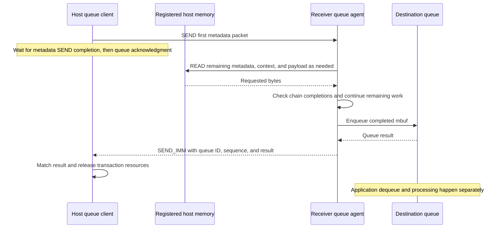

# 04 — Queue/TDT and HDC over UB

[Summary](README.md) · Previous: [task submission](03_trs_task_and_args_submission.md) · Next: [control, registers, and boot](05_control_registers_and_boot.md)

Source snapshot and evidence boundaries: [series scope](README.md#scope-and-evidence).
Expanded on 2026-09-15 against the same `driver` commit, `866e409`. This chapter
covers P5 and P6: remote queue buffer delivery and normal HDC messaging. It
traces the driver/HAL and shared receiver implementations, without claiming a
complete runtime/TDT or device-application execution trace.

## 1. Two messaging interfaces, two payload mechanisms

**Queue enqueue sends metadata and lets the receiver READ the host payload.
HDC normal send copies the payload into a registered session block and SENDs
that block.** Their successful returns describe different protocol boundaries.

| Property | Remote queue buffer enqueue | HDC normal send |
|---|---|---|
| Public entry traced here | `halQueueEnQueueBuff` | `halHdcSend` |
| Initial host action | Register/reference context and iovec ranges; SEND first metadata packet | CPU-copy the message into a registered session block |
| Bulk H2D operation | Receiver-issued URMA READ | Host-issued URMA SEND |
| Destination storage | Receiver constructs an mbuf and private context | Peer supplies posted receive buffers |
| Host success boundary | Matching queue-protocol acknowledgment after local enqueue | Successful SEND completion handling |
| Application-consumption boundary | Later queue dequeue/processing | Later HDC receive/processing |
| Backpressure | Communication resources, destination allocation, queue-full result and event policy | Send-block availability, peer receive availability, transport completion/retry |

Both paths rely on registered memory and URMA resources from the broader
transport architecture. Neither is the SVM `drvMemcpy` loop from document 02,
nor the SQ/argument WRITE chain from document 03. Queue notifications may reuse
TRS task submission without changing the queue payload's READ direction.

The existing [queue/TDT document](../queue_subsystem_host_driver_tdt_and_ub.md)
provides surrounding API context, and the
[buffer document](../buff_subsystem_xsmem_shared_memory.md) covers local mbuf
ownership. Here, “TDT” identifies the queue-facing data-transfer use case; it
does not imply that every TDT caller has been followed through runtime.

Evidence: [queue initial SEND](../../driver/src/ascend_hal/queue/dc/agent/common/que_ini_proc.c#L526),
[queue receiver READ](../../driver/src/ascend_hal/queue/dc/agent/common/que_tgt_proc.c#L660),
[HDC CPU copy and SEND](../../driver/src/ascend_hal/hdc/ub/common/hdc_ub_drv.c#L2127).

## 2. Queue dispatch, resources, and initiator preparation

### The buffer-vector API is the implemented UB client path

`halQueueEnQueueBuff` requires a client-deployed queue, validates its
`buff_iovec`, and calls the selected remote-client API table. The vector
contains optional context bytes plus an array of payload address/length pairs.
Validation checks device/queue IDs, the vector count, context pointer/length
consistency, and nonempty payload ranges.

With `CFG_FEATURE_QUE_SUPPORT_UB` enabled, initialization obtains the connection
type through DMS and selects `que_clt_ub_get_api` for UB. Its `api_enque_buf`
entry calls `que_clt_api_enque`, which delegates to `que_ctx_enque`.

A similarly named API must not be substituted into this trace: the UB client
communication table's direct mbuf enqueue/dequeue adapters, `que_clt_enque`
and `que_clt_deque`, return `DRV_ERROR_NOT_SUPPORT` in this snapshot. The
supported buffer-vector path does construct an mbuf at the receiver, but that
does not make the direct client mbuf adapter implemented.

Evidence: [buffer-vector API and selection](../../driver/src/ascend_hal/queue/dc/agent/client/remote/que_clt_api.c#L63),
[input validation](../../driver/src/ascend_hal/queue/dc/agent/client/common/queue_client_comm.c#L123),
[vector layout](../../driver/pkg_inc/ascend_hal_define.h#L253),
[direct mbuf adapter stubs](../../driver/src/ascend_hal/queue/dc/agent/client/remote/que_clt_ub/que_clt_ub.c#L466),
[UB buffer adapter](../../driver/src/ascend_hal/queue/dc/agent/client/remote/que_clt_ub/que_clt_ub.c#L762),
[API tables](../../driver/src/ascend_hal/queue/dc/agent/client/remote/que_clt_ub/que_clt_ub.c#L854).

### Context and communication-resource ownership

A device queue context contains process identity, tokens, pools of send and
receive resources, and an imported peer receive endpoint. Initialization
exchanges endpoint information; `que_h2d_info_fill` publishes a host JFR ID
and token, and `que_ctx_h2d_init` imports the returned peer JFR and initializes
subscription state. Resource setup follows the context's resource bitmap,
with reverse-order cleanup on initialization failure and teardown.

For each `H2D_SYNC_ENQUE`, `que_ctx_update` borrows a JFS for the metadata SEND
and a JFR for the immediate-data acknowledgment. It installs those resources
in the queue's initiator state. Segment registration uses the queue channel's
token information when available, otherwise the context token.

| Lifetime | Representative state |
|---|---|
| Device queue context | Host/device process association, peer endpoint, subscription flags, resource pools |
| Queue channel | Initiator/target state, queue identity, sequence state, memory-range manager |
| Enqueue call | Borrowed metadata-send and acknowledgment-receive resources |
| Enqueue attempt | `que_tx`, packet storage, context/data segment references and registration nodes |
| Receiver transaction | Destination mbuf/context storage, imported sender segments, remaining metadata, READ-chain progress |

The successful host call chain is:

```text
halQueueEnQueueBuff
  -> que_clt_api_enque
  -> que_ctx_enque
       -> acquire context and borrow JFS/JFR resources
       -> que_chan_pkt_send
            -> que_ini_pkt_send
                 -> create/register transaction and fill metadata
                 -> SEND first packet and wait for transport completion
       -> que_chan_wait
            -> que_ini_ack_wait
       -> que_chan_done
       -> return borrowed JFS/JFR resources and context reference
```

Evidence: [endpoint exchange/import](../../driver/src/ascend_hal/queue/dc/agent/client/remote/que_clt_ub/que_ctx.c#L147),
[context resource lifecycle](../../driver/src/ascend_hal/queue/dc/agent/common/que_comm_ctx.c#L392),
[resource borrowing and enqueue loop](../../driver/src/ascend_hal/queue/dc/agent/client/remote/que_clt_ub/que_ctx.c#L400),
[channel send/wait/resource assignment](../../driver/src/ascend_hal/queue/dc/agent/client/remote/que_clt_ub/que_chan.c#L131).

### Registration merges address ranges, not payload bytes

`que_tx_create` computes total payload length, selects the first group of
iovec descriptors, allocates metadata storage, and prepares context/data
segments. Before registering, `que_mem_merge` page-aligns the relevant ranges
and coalesces overlapping or contiguous registration regions in a tree.
`que_mem_seg_register` can then return the same stored segment for several
addresses in a merged region.

This is registration reuse within the transaction's range manager. It does
not concatenate the application's payload through a CPU copy. Packet nodes
retain each original iovec address and length; the receiver later copies their
bytes in vector order into its destination mbuf.

The host platform classifies memory using the first payload address's SVM
attributes. Ordinary user memory or an attribute-query failure selects
`MEM_NOT_SVM`; other supported managed ranges select `MEM_OTHERS_SVM`; a locked
device-memory attribute selects `MEM_DEVICE_SVM`. The initiator chooses pinned
registration for ordinary payloads and context, and non-pin registration for
`MEM_OTHERS_SVM` payloads. Shared-segment branches can reuse a context segment
instead of registering another one; their applicability is platform-dependent.

`MEM_DEVICE_SVM` is a separate protocol mode: ordinary payload-iovec merge and
registration are skipped. It should not be treated as the same host-byte copy
with a different allocator. Section 4 records the device-specific boundary.

Evidence: [transaction creation](../../driver/src/ascend_hal/queue/dc/agent/common/que_ini_proc.c#L139),
[page-aligned merge and registration reuse](../../driver/src/ascend_hal/queue/dc/agent/common/que_mem_merge.c#L150),
[context and payload registration](../../driver/src/ascend_hal/queue/dc/agent/common/que_ini_proc.c#L245),
[host memory classification](../../driver/src/ascend_hal/queue/dc/que_host_ub_adapt.c#L34).

### Metadata has a different size limit from payload

The first metadata SEND fits within **4 KiB**. Its iovec capacity is computed
from the packet/header and node structure sizes, and can be reduced further
by the receiver's READ-work budget. It is not a 4 KiB limit on the queue item.

| Metadata field/group | What it describes |
|---|---|
| Queue identity, operation, sequence, timestamps | Transaction routing and matching |
| Total iovec count/bytes and memory type | Destination sizing and receiver path selection |
| Context node | Context address, size, and segment |
| Iovec nodes | Original payload addresses, lengths, and segments |
| Packet-storage node | Address/size/segment of metadata the receiver can READ |
| Host JFR ID and token | Acknowledgment endpoint and access information |
| First/remaining descriptor counts | Which descriptors arrived in the SEND and which require another fetch |

The initiator explicitly SENDs **only the first packet**. Remaining descriptors
are laid out in a second metadata region beginning at offset 4 KiB in the
registered packet allocation. The receiver READs that region when needed;
the initiator does not issue one SEND for every descriptor group.

`que_uma_send_post_and_wait` enables completion on the metadata SEND and waits
for its JFC result. That result covers the SEND operation. Packet storage and
payload registrations remain needed because the receiver can still READ them
before the queue acknowledgment arrives.

Evidence: [first-descriptor budget and packet allocation](../../driver/src/ascend_hal/queue/dc/agent/common/que_ini_proc.c#L87),
[packet/header construction](../../driver/src/ascend_hal/queue/dc/agent/common/que_ini_proc.c#L456),
[initial SEND](../../driver/src/ascend_hal/queue/dc/agent/common/que_ini_proc.c#L526),
[SEND completion handling](../../driver/src/ascend_hal/queue/dc/agent/common/que_uma.c#L427),
[packet-capacity formula](../../driver/src/ascend_hal/queue/dc/agent/common/que_ub_msg.h#L23).

## 3. Queue receiver pull, local enqueue, and acknowledgment

### Construct destination storage and READ the sender's ranges

For ordinary host-buffer enqueue, the shared receiver allocates an aligned
mbuf with data length equal to the sum of the iovec lengths. It obtains the
mbuf's private-context area and creates aligned temporary context storage.
The payload and temporary context ranges obtain usable local segments.

The first receiver work chain can contain:

1. A READ of the remaining metadata region, if descriptors did not all fit
   in the initial packet.
2. A READ of the sender's context, when supplied, into aligned context storage.
3. READs for payload ranges described by the first packet.

For a payload iovec, `que_data_wr_fill` uses the sender node's address as the
remote source and `rx_mbuf.data_va + copied_iovec_size` as the local destination.
The offset makes the received data a concatenation in vector order even when
source ranges are unrelated. The receiver imports each sender segment using
the packet's token information.

Context handling is separate from payload handling. The context READ uses
the smaller of sender context length and destination private-context capacity;
a later CPU copy installs the prepared context in the destination mbuf.
This prevents the payload transfer from being described as universally free
of CPU copies, even though it avoids the HDC-style host payload staging copy.

Evidence: [destination mbuf/data allocation](../../driver/src/ascend_hal/queue/dc/agent/common/que_tgt_proc.c#L365),
[context allocation and transfer](../../driver/src/ascend_hal/queue/dc/agent/common/que_tgt_proc.c#L186),
[payload READ addresses](../../driver/src/ascend_hal/queue/dc/agent/common/que_tgt_proc.c#L660),
[remaining metadata READ](../../driver/src/ascend_hal/queue/dc/agent/common/que_tgt_proc.c#L725),
[first-chain preparation](../../driver/src/ascend_hal/queue/dc/agent/common/que_tgt_proc.c#L883).

### Work batches and asynchronous continuation

Queue READ/WRITE construction uses chunks of at most **256 MiB per WR**.
The current maximum READ-chain budget is **2,048 WRs**, shared by metadata,
context, and payload work in that chain. Descriptor-count planning and the
receiver's work-budget checks are separate from the queue's item capacity.

`que_jfs_rw_wr_fill` initially marks WRs with relaxed placement ordering,
completion ordering with previous work, and no successful completion request.
Before posting, `que_uma_rw_post_async` terminates the chain and marks its last
WR with strong placement ordering and completion enabled. Its `user_ctx`
identifies the queue channel for the continuation.

On completion, `que_chan_tgt_data_read_and_ack` calls `que_tgt_pkt_proc_ex`.
The continuation checks the transport status, releases imports used by the
completed chain, and builds more payload work from the remaining metadata
when necessary. It posts another chain or proceeds to local enqueue when all
iovecs have been accounted for. The source's copied-byte/iovec counters are
advanced during work construction; the completion callback supplies the
transport-success check before the normal final enqueue path.

The receiver can stop adding iovecs when the current chain's budget is full
and continue later. These construction rules are not a blanket guarantee that
arbitrary vector shapes or unbounded individual ranges are accepted.

Evidence: [size and WR-budget constants](../../driver/src/ascend_hal/queue/dc/agent/common/que_uma.h#L25),
[maximum WR count](../../driver/src/ascend_hal/queue/command/queue_h2d_user_ub_msg.h#L20),
[READ/WRITE construction](../../driver/src/ascend_hal/queue/dc/agent/common/que_uma.c#L24),
[last-WR completion setup](../../driver/src/ascend_hal/queue/dc/agent/common/que_uma.c#L533),
[iovec batching](../../driver/src/ascend_hal/queue/dc/agent/common/que_tgt_proc.c#L766),
[completion dispatch](../../driver/src/ascend_hal/queue/dc/agent/common/que_comm_chan.c#L641),
[continuation](../../driver/src/ascend_hal/queue/dc/agent/common/que_tgt_proc.c#L949).

### The acknowledgment follows the queue operation

After successful transfer processing, `que_tgt_post_proc` installs the mbuf
context and calls `queue_enqueue_local`. On success it releases temporary
transport/context resources while retaining the mbuf for the queue. On failure
it cleans up the receiver's constructed mbuf instead.

The acknowledgment packs queue ID, transaction sequence, result, and timing
information into immediate data. `que_tgt_proc_ack` sends it using
`URMA_OPC_SEND_IMM` with no payload SGEs and waits for that SEND's transport
completion. The host's `que_ini_ack_wait` accepts an acknowledgment only after
matching queue ID and sequence; a mismatched acknowledgment causes another
wait with adjusted remaining time.



A successful acknowledgment therefore reports **destination queue insertion**,
not consumption by the device application. The code shown is the shared
receiver protocol; device deployment, scheduling, and the eventual consumer
are not fully established by this host checkout.

Evidence: [local enqueue and ownership transfer](../../driver/src/ascend_hal/queue/dc/agent/common/que_tgt_proc.c#L608),
[successful mbuf post-processing](../../driver/src/ascend_hal/queue/dc/agent/common/que_tgt_proc.c#L489),
[acknowledgment construction](../../driver/src/ascend_hal/queue/dc/agent/common/que_tgt_proc.c#L853),
[SEND_IMM](../../driver/src/ascend_hal/queue/dc/agent/common/que_uma.c#L449),
[host acknowledgment matching](../../driver/src/ascend_hal/queue/dc/agent/common/que_ini_proc.c#L593).

## 4. Queue backpressure, cleanup, and related paths

### Queue-full retry differs from transport retry

A queue-full result comes back through the acknowledgment after the receiver's
local enqueue attempt. If the caller has subscribed to full-to-not-full events,
`que_is_need_sync_wait` suppresses an internal capacity wait so the result can
be handled through that event policy. Otherwise `que_ctx_enque` can call
`queue_wait_event` and retry after a capacity notification.

`queue_wait_event` allocates an ESCHED event resource, subscribes to the relevant
queue transition, waits, and unsubscribes/releases the resource. On a successful
wait, the enqueue loop reduces its remaining capacity-wait timeout, destroys
the old transaction, and starts another attempt. That new attempt repeats
transaction preparation and metadata/payload processing; the full result does
not reserve a destination slot for the retry.

| Waiting/retry stage | Source behavior |
|---|---|
| Borrow metadata-send and acknowledgment-receive resources | Separate internal resource-allocation timeout |
| Metadata SEND completion | Internal transport wait; ACK-timeout status can recreate the JFS and resend |
| Queue acknowledgment | Separate protocol wait and queue/sequence matching |
| Queue-full capacity wait | Caller timeout and event-subscription policy control whether to wait and retry |
| Receiver READ-chain ACK timeout | Receiver can recreate its JFS and repost the pending chain |

On the normal non-FPGA build, resource acquisition and transport waits use
5,000 ms constants, and the enqueue acknowledgment call uses
`QUEUE_SYNC_TIMEOUT == 5000`. FPGA branches use larger constants. These are
separate stage limits. The caller's queue-capacity timeout is updated around
the event wait, not measured once across registration, SEND, receiver work,
and all retries. It is not a proven whole-call wall-clock deadline.

The acknowledgment loop also recognizes a special transport-ACK-timeout result
as a reason to continue waiting. Transport retry and queue-full retry have
different triggers; neither should be presented as an application-level
exactly-once guarantee.

Evidence: [enqueue retry and cleanup loop](../../driver/src/ascend_hal/queue/dc/agent/client/remote/que_clt_ub/que_ctx.c#L431),
[subscription-aware wait policy](../../driver/src/ascend_hal/queue/dc/agent/client/remote/que_clt_ub/que_ctx.c#L287),
[event wait and timeout update](../../driver/src/ascend_hal/queue/dc/agent/client/common/queue_client_comm.c#L20),
[transport wait constants](../../driver/src/ascend_hal/queue/dc/agent/common/que_uma.h#L17),
[protocol wait constant](../../driver/src/ascend_hal/queue/dc/core/queue.h#L55),
[metadata transport retry](../../driver/src/ascend_hal/queue/dc/agent/common/que_uma.c#L471),
[receiver retry](../../driver/src/ascend_hal/queue/dc/agent/common/que_tgt_proc.c#L949).

### Transaction cleanup and ownership

`que_chan_done` releases the initiator transaction through `que_ini_proc_done`.
This frees packet storage, clears context/iovec references, and erases the
merged registration tree, destroying privately created segments. Shared context
segments are excluded from private destruction. The call then returns borrowed
JFS/JFR resources and releases its context reference.

| Object | Successful enqueue ownership boundary |
|---|---|
| Caller context and payload ranges | Must remain usable while the receiver can READ them; successful matching acknowledgment ends this transaction's use |
| Initiator metadata allocation | Retained beyond initial SEND completion because the receiver may READ remaining descriptors |
| Initiator registrations | Cleaned up with the transaction, rather than at the first SEND completion |
| Receiver temporary context/metadata and segment imports | Released as chains/transaction finish |
| Receiver mbuf | Retained by the destination queue on successful local enqueue; freed on receiver failure paths |

The sender does not free application-owned iovec buffers. On errors, visible
cleanup is not proof that the remote operation never happened: for example,
an acknowledgment failure can occur after a successful local enqueue. Any
application retry or recovery must use the higher-level protocol contract.

At context teardown, the client first removes/destroys queue contexts, then
releases URMA context references in a second pass. The source explicitly uses
that separation to avoid deleting a transport context still in use.

Evidence: [transaction cleanup](../../driver/src/ascend_hal/queue/dc/agent/common/que_ini_proc.c#L408),
[registration-tree cleanup](../../driver/src/ascend_hal/queue/dc/agent/common/que_mem_merge.c#L124),
[channel completion cleanup](../../driver/src/ascend_hal/queue/dc/agent/common/que_comm_chan.c#L409),
[receiver mbuf ownership](../../driver/src/ascend_hal/queue/dc/agent/common/que_tgt_proc.c#L489),
[client context teardown](../../driver/src/ascend_hal/queue/dc/agent/client/remote/que_clt_ub/que_ctx.c#L377).

### Reverse direction, device-memory mode, and notifications

`H2D_SYNC_DEQUE` identifies a host-initiated queue operation whose bulk data
moves in the reverse direction. The receiver uses WRITE for payload/context
back to the initiating host buffers. The `H2D` prefix alone therefore does not
classify the bulk direction.

For `MEM_DEVICE_SVM`, a single supplied device range can be wrapped as a bare
mbuf, and further handling delegates to `que_rx_pkt_bare_proc_platform`.
The host implementation of that target hook returns `NOT_SUPPORT`. This
checkout does not establish that mode as another complete H2D copy of host
bytes. Likewise, the shared `ASYNC_ENQUE` branches serve related forwarding
scenarios and should not replace the `H2D_SYNC_ENQUE` public-client trace above.

Some queue notifications construct an ESCHED topic SQE and call
`halSqTaskSend`. They reuse P3 from document 03. Queue creation, subscription,
and other service messages also have control exchanges, whose broader transport
is covered in document 05. Neither kind of notification is the bulk payload
READ itself.

Evidence: [dequeue WRITE selection](../../driver/src/ascend_hal/queue/dc/agent/common/que_tgt_proc.c#L259),
[bare-mbuf construction](../../driver/src/ascend_hal/queue/dc/agent/common/que_tgt_proc.c#L365),
[host platform boundary](../../driver/src/ascend_hal/queue/dc/que_host_ub_adapt.c#L87),
[operation-specific packet routing](../../driver/src/ascend_hal/queue/dc/agent/common/que_ini_proc.c#L550),
[topic task submission](../../driver/src/ascend_hal/queue/dc/agent/client/remote/que_clt_ub/que_topic_sched.c#L135).

## 5. HDC selection, session setup, and memory

### Follow the nested transport selection

`halHdcSend` selects `hdc_ub_send` when `h2d_type == HDC_TRANS_USE_UB`. This sits
inside an outer `trans_type == HDC_TRANS_USE_PCIE` branch. Initialization uses
that older outer category for both PCIe and UB and obtains the actual H2D
connection type through DMS. Reading only the outer condition gives the wrong
transport classification.

The normal send checker validates the session, message, first buffer pointer,
and positive length. The UB implementation uses `p_msg->bufList[0]`; it does
not walk a scatter/gather array or split a large application message across
multiple session blocks. Its lower length check accepts at most
**`HDC_MEM_BLOCK_SIZE == 4096` bytes** for this normal SEND path.

The legacy fast-send and fast-receive paths explicitly reject UB. They are not
additional supported UB bulk mechanisms in this snapshot. HDC file-service
helpers call `halHdcSend`, adding their protocol around the normal transport;
their existence does not remove the underlying normal-send block limit.

Evidence: [connection selection](../../driver/src/ascend_hal/hdc/common/hdc_core.c#L520),
[normal-send validation/dispatch](../../driver/src/ascend_hal/hdc/common/hdc_core.c#L1987),
[UB length check](../../driver/src/ascend_hal/hdc/ub/common/hdc_ub_drv.c#L2276),
[block-size constant](../../driver/src/ascend_hal/hdc/inc/hdc_ub_drv.h#L68),
[fast-send rejection](../../driver/src/ascend_hal/hdc/common/hdc_core.c#L2101),
[fast-receive rejection](../../driver/src/ascend_hal/hdc/common/hdc_core.c#L2314),
[file-service send](../../driver/src/ascend_hal/hdc/common/hdc_file_common.c#L176).

### Session control uses the kernel; payload SEND uses userspace URMA

The connect path prepares event handling and session memory, obtains a kernel
session identity, initializes local userspace URMA resources, registers receive
event handling, and sends a connect control message. Its reply supplies the
peer session identity and JFR information, which are imported before the
session enters `HDC_SESSION_STATUS_CONN`. The accept side performs the matching
resource and endpoint exchange.

`hdc_send_ctrl_msg` packages control data into
`hdc_ub_ioctl(HDCDRV_SEND_CTRL_MSG)`. The host kernel forwarding helper sends
it on the device's HDC control channel through `devdrv_sync_msg_send`.
Connect/accept/close control thus has a different path from the payload
`urma_post_jfs_wr(SEND)` call.

The device-level URMA context and token ID are shared and reference-counted
across HDC sessions. Each session has its own buffer registration, JFS/JFR,
send/receive completion resources, imported peer endpoint, and receive-list
state. A first session may pay shared-context initialization costs that later
sessions reuse.

Evidence: [connect and endpoint exchange](../../driver/src/ascend_hal/hdc/ub/common/hdc_ub_drv.c#L1185),
[accept](../../driver/src/ascend_hal/hdc/ub/common/hdc_ub_drv.c#L1343),
[control ioctl wrapper](../../driver/src/ascend_hal/hdc/ub/common/hdc_ub_drv.c#L304),
[kernel control forwarding](../../driver/src/sdk_driver/hdc/ub/host/hdcdrv_adapt_ub.c#L156),
[shared context creation/reference counting](../../driver/src/ascend_hal/hdc/ub/common/hdc_ub_drv.c#L936),
[peer endpoint import](../../driver/src/ascend_hal/hdc/ub/common/hdc_ub_drv.c#L475).

### A session has separate send and receive blocks

| Resource/constant | Value or role in this snapshot |
|---|---|
| Session memory pool | 128 KiB: 32 blocks × 4 KiB |
| Send blocks / JFS configured depth | 16; first half of the pool |
| Receive blocks / JFR configured depth | 16; second half of the pool |
| JFS payload representation | One SGE, no inline data, reliable-message mode |
| Send-block ownership | Availability flags plus a semaphore |
| Receive-buffer ownership | Preposted JFR WRs, then queued completion entries until receive consumption/repost |
| Receive software ring | `HDC_RX_LIST_LEN == 17`, preserving a spare ring slot |

On the host, the DMP service uses a kernel-backed shared mapping. Other service
types take the shared anonymous-mapping branch. `hdc_register_own_urma_seg`
registers the session pool as non-cacheable, local-only access, with a valid
token ID. It uses non-pin registration for the kernel pool and pinned
registration for the anonymous mapping.

The local-only access is consistent with SEND/receive-buffer use: this path
imports the peer JFR rather than giving the sender a remote payload address
for an RMA READ/WRITE. The receiver has already posted buffers describing
where arriving SEND data can land.

`hdc_init_context_jfr_seg` posts the last 16 pool blocks to the JFR. Their
`user_ctx` values are block indices offset by the 16 send blocks. Receive
completion later uses those indices to recover buffer addresses. Comments
mentioning other historical buffer sizes should not override these active
constants and setup loops.

Evidence: [pool/depth constants and ring size](../../driver/src/ascend_hal/hdc/inc/hdc_ub_drv.h#L68),
[service selection](../../driver/src/ascend_hal/hdc/inc/hdc_ub_drv.h#L163),
[host mapping and registration](../../driver/src/ascend_hal/hdc/ub/host/hdc_ub_adapt.c#L17),
[JFS/JFR configuration](../../driver/src/ascend_hal/hdc/ub/common/hdc_ub_drv.c#L607),
[receive-block posting and resource setup](../../driver/src/ascend_hal/hdc/ub/common/hdc_ub_drv.c#L711).

## 6. HDC payload send, completion, and backpressure

### One staged block per normal send

```text
halHdcSend
  -> validate session/message and derive wait policy
  -> hdc_ub_send
       -> lock and validate session; rebuild missing JFS if necessary
       -> hdc_init_jfs_wr
            -> check message fits one 4 KiB block
            -> acquire send-block slot
            -> CPU-copy application bytes into the registered block
            -> build one SEND WR
       -> hdc_post_jfs_wr
            -> check session status and timeout policy
            -> urma_post_jfs_wr
            -> hdc_jfc_process
            -> release block, or retain it for the retry branch
       -> return result through HAL error mapping
```

The registered source is
`session->user_va + seg_id * HDC_MEM_BLOCK_SIZE`. `hdc_fill_jfs_wr` copies the
application bytes there, attaches the session's local segment, requests a
successful completion, and sets the WR opcode to `URMA_OPC_SEND`. The original
application buffer is not the source address stored in that WR.

This gives HDC a predictable per-send staging copy. Registration is normally
amortized over session lifetime rather than repeated for each application
buffer. It also distinguishes HDC from queue registration-range merging,
which leaves payload bytes in their original host ranges for receiver READs.

Evidence: [normal-send orchestration](../../driver/src/ascend_hal/hdc/ub/common/hdc_ub_drv.c#L2457),
[block acquisition and length check](../../driver/src/ascend_hal/hdc/ub/common/hdc_ub_drv.c#L2276),
[CPU copy and SEND construction](../../driver/src/ascend_hal/hdc/ub/common/hdc_ub_drv.c#L2127),
[post and block release](../../driver/src/ascend_hal/hdc/ub/common/hdc_ub_drv.c#L2315).

### Successful SEND completion is awaited

`hdc_jfc_process` calls `ascend_urma_wait_jfc` with timeout **`-1`**, with an
explicit comment that send must wait for its completion. It checks the returned
JFC, polls a completion record and its status, acknowledges the event, and
rearms the JFC. The normal successful path then returns its internal send block
to the availability flags/semaphore and updates send statistics.

```mermaid
sequenceDiagram
    participant A as Host application
    participant H as HDC sender
    participant S as Registered send block
    participant R as Peer posted receive buffer
    participant P as Peer receive/application path
    A->>H: halHdcSend
    H->>S: CPU-copy message
    H->>R: URMA SEND from registered block
    Note over H,R: Sender waits for transport completion
    H->>H: Poll, check, acknowledge, rearm; release send block
    H-->>A: Send result
    R-->>P: Receive completion identifies filled block
    P->>P: Queue received block, then copy to caller on receive
    P->>R: Repost block for a later SEND
    Note over H,P: Sender success does not require application consumption
```

The receive-completion and sender-return timing in the diagram is schematic;
the source does not establish a fixed ordering between their host threads.
SEND completion is the sender's transport success boundary. It does not
establish that the remote application called receive or processed the message.

Evidence: [sender completion wait](../../driver/src/ascend_hal/hdc/ub/common/hdc_ub_drv.c#L2158),
[completion status classification](../../driver/src/ascend_hal/hdc/ub/common/hdc_ub_drv.c#L2003),
[block release and accounting](../../driver/src/ascend_hal/hdc/ub/common/hdc_ub_drv.c#L2315).

### Wait flags govern policy, not a universal deadline

The public flag decoder gives timed-wait precedence over NOWAIT; otherwise it
selects wait-always. That policy feeds block acquisition, status/elapsed-time
checks, and completion-error handling. It does **not** change the successful
post-SEND event wait from `-1`.

| Policy/stage | Visible behavior |
|---|---|
| Send-block acquisition | Semaphore wait plus slot selection; finite or indefinite form depends on internal wait state |
| `HDC_NOWAIT` | Changes resource/error policy; a reported send-completion error can map to non-blocking failure |
| Timed wait | Tracks elapsed time around status/retry processing and can return TX timeout |
| Post-SEND completion event | Uses `-1` independently of the public policy |
| Retryable receive/transport status | Can retain the send block and repost after a short sleep and session revalidation |
| Transport ACK-timeout status | Requests JFS rebuild; rebuilding resources does not make the original message a successful send |

Thus NOWAIT is not evidence of an enqueue-and-return asynchronous API, and
the public timeout is not a proven hard deadline over every internal stage.
A lack of peer receive buffers can affect SEND progress even when the sender
has a free local staging block.

`hdc_poll_jfc` classifies selected transport statuses as retry, rebuild, closed
session, or abnormal link. On `HDC_TIMEOUT_RETRY`, the send path keeps the
prepared block, releases the session lock, sleeps, reacquires the lock,
revalidates the session, and retries. Other result paths release the block;
an ACK-timeout rebuild reports failure of this send rather than silently
converting it to success.

The public wrapper maps selected internal results to `DRV_ERROR_NON_BLOCK`,
`DRV_ERROR_WAIT_TIMEOUT`, socket-close, or link-abnormal errors; other send
failures can become `DRV_ERROR_SEND_MESG`. These results identify the visible
failure stage, not whether the peer application took any action.

Evidence: [flag precedence](../../driver/src/ascend_hal/hdc/common/hdc_core.c#L1575),
[send-slot acquisition](../../driver/src/ascend_hal/hdc/ub/common/hdc_ub_drv.c#L635),
[wait state and completion policy](../../driver/src/ascend_hal/hdc/ub/common/hdc_ub_drv.c#L2109),
[timeout/status and rebuild](../../driver/src/ascend_hal/hdc/ub/common/hdc_ub_drv.c#L2227),
[retry orchestration](../../driver/src/ascend_hal/hdc/ub/common/hdc_ub_drv.c#L2493),
[HAL error mapping](../../driver/src/ascend_hal/hdc/common/hdc_core.c#L2040).

## 7. HDC receive ownership and session teardown

### Receive completion queues a block; receive consumption reposts it

The visible shared HDC receive implementation processes the receive JFCE/JFC
through its event handler. `hdc_recv_data_in_event_handle` checks session/ring
state, waits for the indicated receive completion, polls and checks it,
acknowledges/rearms the JFC, and appends an entry to the software receive list.
That entry records the pool address, segment, block index, and actual
`completion_len`. A condition variable and optional eventfd notify consumers.

The receive-peek/wait path makes the next message length available without
reposting its buffer. `hdc_ub_recv` later checks destination capacity, copies
the received bytes into the caller's buffer, reposts the session block to the
JFR, and advances the software-list head. In this path, reading the application
message replenishes a transport receive resource.

This creates a concrete backpressure link: if the receiving application stops
consuming messages, filled blocks remain on its receive list and are not yet
reposted. The finite preposted receive pool can then limit later SENDs.
Receiving a transport completion alone does not replenish those blocks.
The exact device application using this shared code remains outside the trace.

Evidence: [receive-list entry construction](../../driver/src/ascend_hal/hdc/ub/common/hdc_ub_common.c#L610),
[receive completion/event handling](../../driver/src/ascend_hal/hdc/ub/common/hdc_ub_common.c#L661),
[receive wait and peek](../../driver/src/ascend_hal/hdc/ub/common/hdc_ub_drv.c#L2378),
[copy to caller and repost](../../driver/src/ascend_hal/hdc/ub/common/hdc_ub_drv.c#L2577).

### Resources are reclaimed at different boundaries

| Object | Lifetime boundary visible in the source |
|---|---|
| Application send buffer | Read during the staging copy; remains caller-owned and is not freed by HDC |
| Internal send block | Acquired per send, retained during retry, released by send result processing |
| Internal receive block | Preposted, filled, queued, then reposted after receive copies it out |
| Application receive buffer | Supplied/owned by caller; receives a CPU copy of the message |
| Session mapping and registration | Live across normal sends/receives; removed during session teardown |
| Peer JFR import and session JFS/JFR/JFC resources | Established by session setup and released by close |
| Device-level URMA context and token ID | Shared until the last HDC session reference is released |

The close handler marks the session idle, removes receive-event registrations,
optionally sends a peer close notification, detaches the event node's context,
unimports the peer JFR, and deletes session resources. Resource teardown removes
the receive JFR/JFC, send JFS/JFC, and owned segment registration. Kernel session
close precedes unmapping host session memory, and blocked receive waiters are
woken. Shared-context reference counting handles the device-level resources.

This is a session lifecycle protocol. Neither close nor an error return should
be described as proof of remote application consumption or rollback of a
message already delivered. Provider deletion/wait semantics and the peer close
protocol remain part of the external execution contract.

Evidence: [session resource teardown](../../driver/src/ascend_hal/hdc/ub/common/hdc_ub_drv.c#L833),
[shared-context release](../../driver/src/ascend_hal/hdc/ub/common/hdc_ub_drv.c#L1015),
[close ordering and receive wakeup](../../driver/src/ascend_hal/hdc/ub/common/hdc_ub_drv.c#L1548),
[mapping release](../../driver/src/ascend_hal/hdc/ub/host/hdc_ub_adapt.c#L67).

## 8. Comparison, examples, and remaining evidence

The useful completion distinctions across the two paths are:

| Observation | Establishes | Does not establish |
|---|---|---|
| Queue initial SEND completion | Metadata SEND completed successfully | Receiver payload READs or local enqueue completed |
| Queue receiver chain completion | That posted chain's transport result | Entire transaction finished if more descriptors remain |
| Successful matching queue acknowledgment | Receiver reported successful queue insertion | Consumer dequeued/processed the item |
| Successful HDC send return | SEND completion handling succeeded and sender block was released | Peer application consumed the message |
| HDC receive copied bytes and reposted block | Caller has message bytes; receive block can accept more work | Application-specific processing is finished |

These examples illustrate source control flow, not measurements or additional
public API guarantees:

| Example | Expected path |
|---|---|
| Queue vector with separate 1 KiB and 2 KiB host ranges | Metadata names both ranges; receiver places their bytes consecutively in a 3 KiB mbuf |
| Queue vector whose descriptors exceed the first packet's budget | First metadata SEND plus receiver READ of remaining descriptors; not a SEND of the whole payload |
| A supported queue iovec of 300 MiB | READ construction represents its payload as 256 MiB and 44 MiB WRs within the applicable chain budget |
| Destination queue becomes full before local insertion | Receiver can report queue-full after transfer work; host event policy decides whether to wait and start another attempt |
| HDC sends a 2 KiB message | One CPU copy into a 4 KiB registered block, one SEND, completion wait, block release |
| HDC message exceeds 4 KiB | Normal UB send rejects the oversized first buffer; any chunking belongs above this helper |
| Peer HDC application delays receiving | Filled receive blocks remain queued and are not reposted yet, limiting future receive capacity |

Queue costs include range registration, metadata construction/SEND, extra
metadata READs, destination mbuf allocation, payload READs, context copying,
queue insertion, and acknowledgment. HDC costs include session setup amortized
across calls, host staging copies, block availability, SEND completion, and
receiver copying/reposting. These are qualitative source-derived categories;
no bandwidth, latency, or copy-overlap measurements were performed.

A subsequent runtime/TDT trace should establish the exact caller API, memory
classification, ownership rules, event subscription policy, and application
completion used to recycle buffers. For HDC services it should establish how
larger logical messages are framed into normal sends and when the peer consumes
them. The remaining series deep dive is
[05 — Kernel control, register access, and boot](05_control_registers_and_boot.md),
which follows the control traffic supporting these payload paths.
