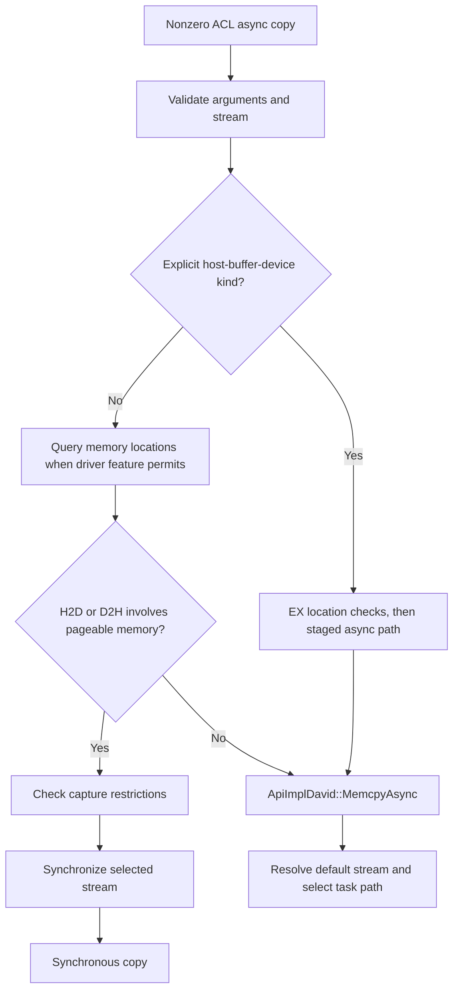
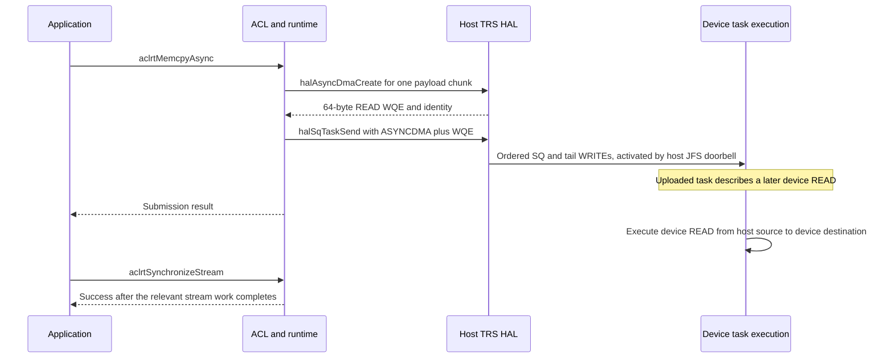

# 06 — ACL/runtime dispatch into the UB paths

[Summary](README.md) · Previous: [Control, registers, and boot](05_control_registers_and_boot.md) · Next: [Mapped host memory and KV cache](07_host_memory_access_and_kv_cache.md)

Analysis date: 2026-09-20. Source snapshots: sibling `runtime` at
`216912472` and `driver` at `866e409`, both clean during this trace. This
chapter connects the full C++ ACL implementation and the 950/v200 runtime
to the HAL paths in documents 02–04. These are source-level call chains;
the checkouts have not been verified as an installed runtime/driver pair.
No device execution or performance measurements were made.

The principal case is host-side execution on a UB-connected device, with an
ordinary stream that is neither model-bound, software-SQ, nor auto-split.
Other selectors are recorded explicitly. This is a trace of memcpy,
representative non-CPU kernel launch, and queue-backed TDT send; it is not
an inventory of every ACL entry point or every graph lifecycle.

## 1. The application action determines the path

**An ACL async name does not by itself select device READ. Runtime first
classifies the memory and stream. Eligible UB async copies prepare READ
work; pageable-memory fallback performs a stream wait and a host WRITE.**

| Application action and selected case | Runtime/HAL boundary | H2D operation and success boundary |
|---|---|---|
| `aclrtMemcpy`, ordinary H2D | `NpuDriver::MemCopySync` → `drvMemcpy` | Host WRITE; copy wait completes before successful return |
| `aclrtMemcpyAsync`, ordinary H2D involving memory classified as pageable | Error decorator → stream synchronization → `MemCopySync` | Earlier stream work is waited, then synchronous host WRITE |
| `aclrtMemcpyAsync`, eligible H2D on an ordinary UB stream | `halAsyncDmaCreate` + `halSqTaskSend` | Host uploads task descriptors; device READ is the prepared payload operation; stream completion is later |
| Async `ACL_MEMCPY_HOST_TO_BUF_TO_DEVICE` | Runtime-owned host staging, then UB async task | CPU/host copy into staging precedes the prepared device READ |
| `aclrtLaunchKernelWithHostArgs`, non-CPU kernel, ordinary stream | `halSqTaskArgsAsyncCopy`, then `halSqTaskSend` | Host argument WRITEs precede task/tail WRITEs on the SQ-associated transport |
| `aclrtLaunchKernel`, argument block already on device | No argument upload through this loader; task submission remains | Launch describes device work; return does not establish kernel completion |
| `acltdtSendTensor`, queue-backed channel | `rtMemQueueEnQueueBuff` → `halQueueEnQueueBuff` | Metadata exchange, receiver READ, and enqueue ACK; ACK is not tensor consumption by the application |

The following sections provide the selectors and source evidence for each
row. In particular, task-descriptor traffic and user-payload traffic are
different transfers even when they belong to the same async copy.

## 2. From exported ACL functions to the v200 implementation

The full C++ ACL layer generates exported wrappers using `ACL_RT_FUNC_MAP`
and `ACL_RT_CPP`; a wrapper calls the corresponding `name##Impl` function.
For memcpy, `aclrtMemcpyImpl` and `aclrtMemcpyAsyncImpl` translate the ACL
copy kind and call `rtMemcpy` or `rtMemcpyAsync`. Both handle zero count
before their pointer checks. The runtime C entries also have zero-count
shortcuts; the nonzero async entry validates and unwraps the stream handle.

Evidence: [wrapper generation](../../runtime/src/acl/aclrt_impl/acl_rt_wrapper.h#L18),
[wrapper instantiation](../../runtime/src/acl/aclrt/acl_rt.cpp#L40),
[kind translation](../../runtime/src/acl/aclrt_impl/memory.cpp#L162),
[ACL sync implementation](../../runtime/src/acl/aclrt_impl/memory.cpp#L650),
[ACL async implementation](../../runtime/src/acl/aclrt_impl/memory.cpp#L684),
[runtime C entries](../../runtime/src/runtime/api/api_c.cc#L1085).

The object dispatch is:

```text
rtMemcpy / rtMemcpyAsync
  -> Api::Instance()
  -> Runtime::Api_(): ApiErrorDecorator
  -> optional profiling decorator
  -> implementation selected by the runtime build/platform
```

The 950 platform registration names `libruntime_v200.so`. Its implementation
creator returns `ApiImplDavid`. `MemcpyAsync` is overridden there;
`MemCopySync` uses the inherited `ApiImpl` implementation. The shared launch
API also reaches build-selected Stars v2 launch code. Consequently, a branch
found in the generic `ApiImpl::MemcpyAsync` is not automatically part of
the David async path.

Evidence: [Api instance](../../runtime/src/runtime/api/api.cc#L18),
[decorator initialization](../../runtime/src/runtime/core/src/runtime.cc#L1515),
[950 library registration](../../runtime/src/runtime/config/950/dev_info_reg.cc#L20),
[v200 creator](../../runtime/src/runtime/api/impl/v200/api_impl_creator_c.cc#L17),
[v200 implementation selection](../../runtime/src/runtime/cmake/v200.cmake#L258),
[Stars v2 launch selection](../../runtime/src/runtime/cmake/v200.cmake#L356).

Product selection and link selection are separate. Runtime queries
`halGetDeviceInfo(..., MODULE_TYPE_SYSTEM, INFO_TYPE_HD_CONNECT_TYPE, ...)`
and tests for `HOST_DEVICE_CONNECT_TYPE_UB`. Later code uses the cached
`GetConnectUbFlag()`. Neither the library name nor a symbol containing
`PCIE` alone proves which transport a call takes.

Evidence: [connection query](../../runtime/src/runtime/driver/v200/npu_driver.cc#L18),
[cached connection flag](../../runtime/src/runtime/core/src/runtime.cc#L1013).

## 3. Synchronous memcpy reaches the SVM WRITE-and-wait path

```text
aclrtMemcpy(..., ACL_MEMCPY_HOST_TO_DEVICE)
  -> aclrtMemcpyImpl
  -> rtMemcpy
  -> ApiErrorDecorator::MemCopySync
  -> ApiImpl::MemCopySync
  -> NpuDriver::MemCopySync
  -> MemCopySyncAdapter
  -> drvMemcpy
  -> SVM synchronous H2D path from document 02
       -> select managed range, staging, or temporary registration
       -> host URMA WRITE
       -> wait, then release temporary copy resources
```

The decorator validates pointers, count, capacity, and kind. The
implementation resolves the current context, checks device/capture state,
and invokes the driver. The 950 properties select
`SDMA_COPY_BY_MEM_SYNC_ADAPTER`. The adapter calls `drvMemcpy` when its
device/module argument has the default `INVALID_COPY_MODULEID` value,
as it does for this ordinary ACL route. A nondefault argument can select
`halMemcpy` with a `memcpy_info`; that is a separate runtime branch.

Evidence: [sync validation](../../runtime/src/runtime/api/impl/api_error.cc#L2128),
[sync implementation](../../runtime/src/runtime/api/impl/api_impl.cc#L2762),
[950 copy method](../../runtime/src/runtime/config/950/dev_info_reg.cc#L261),
[driver default argument](../../runtime/src/runtime/driver/npu_driver.hpp#L156),
[adapter and copy method dispatch](../../runtime/src/runtime/driver/npu_driver_mem.cc#L2150),
[driver/HAL continuation](02_sync_and_async_memcpy.md#2-synchronous-h2d-api-to-transport).

This ordinary sync route contains no implicit `StreamSynchronize` call.
Its successful return establishes the completion of this copy, not a
blanket barrier for all prior work on all streams. Ordering it against an
unrelated stream still requires the application's synchronization contract.

## 4. Async memory classification comes before task creation

Ordinary `rtMemcpyAsync` enters the decorator with `checkKind = true` and
without a memcpy configuration. The decorator can update the effective
copy kind from source/destination locations before choosing the route.



`MemcpyAsyncCheckLocation` first checks the device's `IsSupportUserMem`
capability. Runtime obtains this from
`FEATURE_SVM_GET_USER_MALLOC_ATTR`; the visible SVM v3 driver advertises
the feature. `GetLocationType` calls `PtrGetRealLocation`, which maps
`DV_MEM_USER_MALLOC` to `RT_MEMORY_LOC_UNREGISTERED` unless the separate
registration check recognizes it. Managed/pinned host and registered
host cases have their own mappings.

`JudgeIsInvolvePageableMemory` selects the fallback when kind checking is
enabled, the effective direction is neither H2H nor D2D, and either endpoint
is classified as unregistered. The fallback rejects an explicitly capturing
stream, calls `StreamSynchronize(stm, -1)`, and then calls the implementation's
`MemCopySync`. Other capture restrictions can reject the sync operation too.
When the user-memory attribute feature is absent, the helper can continue
without this classification; the fallback must not be generalized to every
driver version or every configured runtime API.

Evidence: [default kind check](../../runtime/src/runtime/api/api.hpp#L322),
[async validation and fallback](../../runtime/src/runtime/api/impl/api_error.cc#L2175),
[location query](../../runtime/src/runtime/api/impl/api_error.cc#L2609),
[pageable predicate and capability gate](../../runtime/src/runtime/api/impl/api_error.cc#L2788),
[driver location mapping](../../runtime/src/runtime/driver/npu_driver_mem.cc#L2089),
[runtime feature query](../../runtime/src/runtime/core/src/device/raw_device.cc#L252),
[driver feature mapping](../../driver/src/ascend_hal/pbl/queryfeature/query_feature.c#L103),
[SVM feature implementation](../../driver/src/ascend_hal/svm/v3/api/master/svm_get_attr.c#L93).

### Explicit staging is a different branch

ACL translates `ACL_MEMCPY_HOST_TO_BUF_TO_DEVICE` to
`RT_MEMCPY_HOST_TO_DEVICE_EX`. The decorator handles EX kinds separately
from ordinary location-based pageable fallback. In the David task initializer,
`AllocCpyTmpMemForDavid` allocates host memory with alignment padding,
copies the input into an aligned staging address using a synchronous H2H
copy, rewrites the source pointer, and normalizes the kind to H2D.
The task retains the allocation in `srcPtr` for later cleanup.

Ordinary H2D passes through this helper without that allocation or copy.
Thus the original ordinary async source must remain valid until execution
completes; the EX task instead reads the runtime-owned staging bytes after
the initial host copy. Pointers contained inside a staged argument/data block
retain their own lifetime requirements.

Evidence: [EX translation](../../runtime/src/acl/aclrt_impl/memory.cpp#L185),
[EX checks](../../runtime/src/runtime/api/impl/api_error.cc#L2220),
[David staging](../../runtime/src/runtime/core/src/task/task_info/memory/memory_memcpy_async_task.cc#L157),
[task cleanup](../../runtime/src/runtime/core/src/task/task_info/memory/memory_task_v200_base.cc#L419).

## 5. Eligible H2D async copies become ASYNCDMA plus a direct WQE

### Runtime divides the request before the HAL direct-create call

`ApiImplDavid::MemcpyAsync` resolves a null stream to the current context's
default stream, checks the context/stream relationship, and loops over the
requested bytes. `CalculateMemcpyAsyncSingleMaxSize` selects **256 MiB**
for ordinary UB H2D and D2H. Each iteration calls `MemcopyAsync` and advances
by its returned `realSize`.

This resolves the driver-level sizing question from document 02: the HAL
normal direct-create helper packs one WQE, while this runtime caller limits
ordinary UB chunks to 256 MiB. The initial EX kind takes the calculator's
64 MiB default in this snapshot; it is normalized to H2D later inside task
initialization. These are runtime chunk sizes, not a newly inferred public
API maximum.

Evidence: [runtime copy loop](../../runtime/src/runtime/api/impl/api_impl_david.cc#L907),
[UB chunk selector](../../runtime/src/runtime/api/api.hpp#L38),
[64 MiB default](../../runtime/src/runtime/core/inc/spec/base_info.hpp#L171),
[HAL direct-create sizing](02_sync_and_async_memcpy.md#4-trs-asynchronous-copy-preparation).

For an ordinary non-bound stream, `GetSqeNumForMemcopyAsync` reserves two
SQ entries for H2D. `MemcopyAsync` acquires the stream lock, allocates a task,
initializes it with `MemcpyAsyncTaskInitV3`, sends it with `DavidSendTask`,
then unlocks and runs submission postprocessing. Task creation/conversion
errors have a local rollback guard. A failure in a later chunk does not
make the entire API call transactional or undo chunks already submitted.

Evidence: [SQ entry count](../../runtime/src/runtime/core/src/task/task_info/memory/memory_memcpy_async_task.cc#L338),
[task allocation, locking, and submission](../../runtime/src/runtime/core/src/launch/memcpy_starsv2.cc#L209).

### Task conversion obtains a device READ descriptor

```text
MemcpyAsyncTaskInitV3
  -> optional EX staging
  -> ConvertCpyType: H2D -> RT_MEMCPY_DIR_H2D
  -> UB selection: IsDavidUbDma
  -> ConvertAsyncDma                         [non-software SQ case]
  -> NpuDriver::CreateAsyncDmaWqe
  -> halAsyncDmaCreate
  -> TRS direct WQE preparation             [normal non-sink HAL SQ]
       -> locate payload segments
       -> encode device-local destination and remote host source
       -> return 64-byte READ WQE and transport identity
```

The conversion gate is named
`RT_FEATURE_TASK_PCIE_DMA_ASYNC_WITH_USER_VA`, but the 950 configuration
enables it and the code within it selects UB with `IsDavidUbDma`.
This is why the feature's name cannot be read as a transport exclusion.

The runtime wrapper supplies source, destination, payload length, TS/SQ IDs,
and direction to `halAsyncDmaCreate`. Returned `size` becomes `wqeLen`:
it counts **WQE bytes**, not completed or prepared payload bytes.
`HandleUbModeDmaResult` retains the original WQE pointer for destruction
and copies the descriptor into the task's inline WQE storage.

Evidence: [task initialization](../../runtime/src/runtime/core/src/task/task_info/memory/memory_memcpy_async_task.cc#L526),
[UB predicate](../../runtime/src/runtime/core/src/task/task_info/memory/memory_memcpy_async_task.cc#L934),
[950 feature](../../runtime/src/runtime/config/950/dev_info_reg.cc#L63),
[conversion](../../runtime/src/runtime/core/src/task/task_info/memory/memory_task_v200_base.cc#L868),
[result ownership](../../runtime/src/runtime/core/src/task/task_info/memory/memory_task_v200_base.cc#L770),
[HAL wrapper](../../runtime/src/runtime/driver/npu_driver_standard_soc.cc#L23),
[driver H2D opcode](../../driver/src/ascend_hal/trs/core/urma/master/trs_master_async.c#L309).

The driver's `halMemGetSeg` lookup requires usable segment information for
the payload range. Passing the upper location check does not itself pin a
buffer for this transfer. The visible direct WQE path adds no new in-flight
registration reference; the allocation and registration must outlive device
execution. Initial SQ/async-context setup can also involve synchronous
service work before the async payload task is available.

Evidence: [segment and direct-WQE ownership](02_sync_and_async_memcpy.md#4-trs-asynchronous-copy-preparation).

### Submission uploads the descriptor, then execution moves the payload

`ConstructDavidAsyncDmaSqe` produces a direct-mode ASYNCDMA command and
places the returned 64-byte WQE in the next SQ entry. `DavidSendTask`
constructs the SQEs, adds the task to the host public queue, and calls
`halSqTaskSend` with `sqe_num == 2` for this case. It retries
`DRV_ERROR_NO_RESOURCES` while checking device status.



The execution and API-return events can overlap; the diagram does not require
the device to wait until the host API returns. The important distinction is
the absence of a payload-completion guarantee at that return.

The host WRITE chain moves **SQ/task bytes**. The prepared device READ moves
**application payload bytes**. The local host JFS doorbell in document 03
also differs from the device UBDMA doorbell-mode SQE used by other branches.

Evidence: [direct SQE format](../../runtime/src/runtime/core/src/task/task_info/memory/memory_task_v200.cc#L78),
[SQE selector](../../runtime/src/runtime/core/src/task/task_info/memory/memory_task_v200.cc#L170),
[task submission](../../runtime/src/runtime/core/src/task/task_submit/v200/task_david.cc#L530),
[HAL task upload](03_trs_task_and_args_submission.md#3-normal-task-submission).

## 6. Stream completion and resource recycling are separate stages

`SubmitTaskPostProc` normally wakes or attempts the recycler; its
`isNeedStreamSync` argument defaults to false. Bound streams have a separate early return.
Thus completing the API's submission loop is not a stream fence, even
though setup, allocation, or resource-pressure handling can take time.

An explicit stream wait follows this chain:

```text
aclrtSynchronizeStream
  -> aclrtSynchronizeStreamImpl
  -> rtStreamSynchronize
  -> ApiErrorDecorator / ApiImpl::StreamSynchronize
  -> selected/default Stream::Synchronize
       -> StarsWaitForTask, or
       -> SynchronizeImpl
            -> SynchronizeExecutedTask
            -> wait for concerned recycling when required
```

Stars stream synchronization selects the wait/reclaim implementation from
stream mode and whether sending and recycling are separate. The separate
path waits for the relevant executed task/SQ progress, then waits for
recycling of a concerned task if one exists. With no concerned task it can
wake the recycler and return after execution completion. The other Stars
path uses task reclamation/report handling. None of these checks should be
substituted with the successful JFC processing of the earlier SQ upload.

Evidence: [postprocessing](../../runtime/src/runtime/core/src/task/task_submit/v200/task_david.cc#L670),
[default synchronization argument](../../runtime/src/runtime/core/inc/task/task_david.hpp#L27),
[ACL stream wait](../../runtime/src/acl/aclrt_impl/stream.cpp#L121),
[runtime C stream wait](../../runtime/src/runtime/api/api_c_stream.cc#L146),
[stream selection](../../runtime/src/runtime/api/impl/api_impl.cc#L1721),
[execution/recycle wait](../../runtime/src/runtime/core/src/stream/stream.cc#L1947),
[Stars wait selection](../../runtime/src/runtime/core/src/stream/stream.cc#L2054),
[Stars task reclamation](../../runtime/src/runtime/core/src/stream/stream.cc#L4013).

For completed tasks, `TryReclaimToTask` runs `TaskUnInitProc` and recycles
task storage. The memcpy task registers `StarsV2MemcpyAsyncTaskUnInit`,
which reaches `AsyncDmaWqeProc` and, for ordinary non-software-SQ UB copies,
`AsyncDmaWqeBasicProc`. It passes the retained WQE pointer and length to
`NpuDriver::DestroyAsyncDmaWqe` → `halAsyncDmaDestory` (the HAL spelling).
It also releases EX staging through `ReleaseCpyTmpMemForDavid`.

Evidence: [task reclamation](../../runtime/src/runtime/core/src/task/task_recycle/v200/task_recycle_common_base.cc#L169),
[memcpy task registration](../../runtime/src/runtime/core/src/task/task_info/memory/memory_task_v200.cc#L210),
[WQE and staging cleanup](../../runtime/src/runtime/core/src/task/task_info/memory/memory_task_v200_base.cc#L373),
[HAL destroy wrapper](../../runtime/src/runtime/driver/npu_driver_standard_soc.cc#L75).

| Resource | Owner and release boundary in the traced ordinary path |
|---|---|
| Ordinary async source/destination and their registrations | Application/allocation subsystem; preserve through successful execution completion |
| EX source staging | Runtime task; freed during task cleanup after its use |
| Returned direct-WQE tracking object | HAL allocation retained by runtime; destroyed through the task cleanup path |
| Inline WQE/SQE/task bookkeeping | Runtime/HAL task and queue storage; submission and recycling have their own lifetimes |
| SQ async context and communication resources | SQ/stream resources; not recreated and destroyed for every payload chunk |

A successful stream wait establishes execution completion according to the
runtime's task-report/SQ-progress contract. It does not promise that every
unconcerned internal pool object has already been reclaimed. Error/timeout
returns likewise do not establish that all remote work has stopped.
Firmware ordering, cache visibility, and abort quiescence still require
device-side or interface evidence beyond this host call chain.

## 7. Graph and alternate SQ branches must retain their own selectors

The ordinary chain above cannot be pasted unchanged onto every stream:

| Selector in the source | Different behavior visible in this pass |
|---|---|
| Software SQ in `ConvertAsyncDma` | Uses `ConvertAsyncDmaForSoftWareSqUb` and `StreamJettyHandler`; caller-owned WQE conversion replaces ordinary direct create |
| Model-bound UB copy in SQE construction | Produces a UBDMA doorbell-mode command |
| 2D or batch UB copy | Uses its dedicated conversion/progress logic and the doorbell-mode SQE |
| Software SQ in `DavidSendTask` | Copies constructed SQEs into cached stream storage and returns before the ordinary `halSqTaskSend` branch |
| Auto-split SQ in `DavidSendTask` | Writes into host SQ storage through its separate helper |
| UB async copy in a submodel | Decorator can reject it as unsupported |

`StreamJettyHandler` appends converted WQEs to stream-owned context storage
and later exposes a fill/upload phase. These correspond to the driver's
standalone jetty, conversion, and fill APIs already described in document
02. [Document 08](08_graph_and_software_sq_lifecycle.md) follows this branch
through graph finalization, first upload, replay, updates, idle reclamation,
and ordinary destruction, while identifying the remaining device contracts.
[Document 09](09_runtime_2d_and_batch_bookkeeping.md) follows 2D/batch
progress and completion bookkeeping through these ordinary/captured selectors.

Evidence: [software-SQ conversion](../../runtime/src/runtime/core/src/task/task_info/memory/memory_task_v200_base.cc#L797),
[WQE context and conversion](../../runtime/src/runtime/feature/jetty/stream_jetty_handler.cc#L98),
[fill phase](../../runtime/src/runtime/feature/jetty/stream_jetty_handler.cc#L275),
[SQE selector](../../runtime/src/runtime/core/src/task/task_info/memory/memory_task_v200.cc#L170),
[deferred submission branches](../../runtime/src/runtime/core/src/task/task_submit/v200/task_david.cc#L567),
[submodel and capture checks](../../runtime/src/runtime/api/impl/api_error.cc#L2252).

## 8. Kernel launch connects host argument staging to ordered task upload

The selected public example is `aclrtLaunchKernelWithHostArgs` for a
registered non-CPU kernel. Its implementation calls
`rtsLaunchKernelWithHostArgs`, which builds `rtArgsEx_t` with
`isNoNeedH2DCopy = 0` and dispatches `LaunchKernelV2`:

```text
aclrtLaunchKernelWithHostArgsImpl
  -> rtsLaunchKernelWithHostArgs
  -> ApiErrorDecorator::LaunchKernelV2
  -> ApiImpl::LaunchKernelV2
  -> StreamLaunchKernelV2                  [v200 / aix_starsv2.cc]
       -> acquire stream lock and allocate kernel task
       -> LoadArgsForStreamLaunchV2
       -> Stream::LoadArgsInfo
       -> StarsArgManager::LoadArgs
       -> allocate args, fix embedded addresses, H2DArgCopy
       -> attach device argument address/ownership to task
       -> DavidSendTask -> halSqTaskSend
       -> unlock and submission postprocessing
```

Evidence: [ACL host-argument launch](../../runtime/src/acl/aclrt_impl/kernel.cpp#L491),
[runtime host-argument entry](../../runtime/src/runtime/api/api_c_kernel.cc#L46),
[launch decorator](../../runtime/src/runtime/api/impl/api_error.cc#L1039),
[shared launch dispatch](../../runtime/src/runtime/api/impl/api_impl.cc#L1296),
[Stars v2 launch](../../runtime/src/runtime/core/src/launch/aix_starsv2.cc#L542),
[argument manager dispatch](../../runtime/src/runtime/core/src/stream/stream.hpp#L195),
[copy policy](../../runtime/src/runtime/core/src/kernel/arg_loader/stars_arg_manager.hpp#L93).

`DavidStream::CreateStreamArgRes` selects `UbArgManage` from the UB connection
flag. Its allocation path uses a stream argument pool where eligible and
available, otherwise the device's UB argument loader. The stream pool
contains paired host/device allocations and segment information.
`H2DArgCopy` first copies the caller's argument bytes into the owned host
buffer. `ParseArgsCpyWqe` then fills `halSqTaskArgsInfo` with the selected
SQ, addresses, size, and source/destination segment handles.
`NpuDriver::SqArgsCopyWithUb` calls `halSqTaskArgsAsyncCopy`.

Evidence: [UB manager selection](../../runtime/src/runtime/core/src/stream/stream_david.cc#L239),
[allocation and argument copy](../../runtime/src/runtime/core/src/kernel/arg_loader/arg_manage_ub.cc#L22),
[embedded address fixups](../../runtime/src/runtime/core/src/kernel/arg_loader/stars_arg_manager.cc#L175),
[HAL argument wrapper](../../runtime/src/runtime/driver/npu_driver_standard_soc.cc#L448).

For the ordinary stream, the stream lock spans argument loading and the
following `DavidSendTask`. This supplies the caller serialization that was
missing from the HAL-only trace in document 03. The HAL argument call posts
WRITEs without ringing the JFS doorbell; the later task/tail WRITE submission
activates that SQ-associated chain. This order is scoped to the selected
stream/SQ, not to other streams or the SVM sync-copy channel pool.

The task keeps the device argument address, loader handle, and stream-pool
position through `SetArgsAix`. Stream task-release helpers return loader
handles and advance argument-pool reuse state. The staging block protects
the copied argument bytes; device pointers embedded in those bytes still
refer to allocations that must remain usable for kernel execution.

Evidence: [attach argument ownership](../../runtime/src/runtime/core/src/launch/aix_starsv2.cc#L77),
[stream argument recycling](../../runtime/src/runtime/core/src/stream/stream_david.cc#L1380),
[argument pool batch release](../../runtime/src/runtime/core/src/task/task_recycle/v200/task_recycle_common_base.cc#L203),
[HAL argument/task ordering](03_trs_task_and_args_submission.md#4-argument-upload-and-its-dependency-on-submission).

Two variations change the upload step. `aclrtLaunchKernelImpl` sets
`isNoNeedH2DCopy = 1`, so this generic argument-loader policy retains the
provided device argument pointer without an H2D copy. For software-SQ or
auto-split streams, `UbArgManage::ParseArgsCpyWqe` instead calls
`MemCopySync` to upload staged arguments. That code comment says `halMemcpy`,
but the actual wrapper dispatch is the adapter described in section 3.

Evidence: [device-argument entry](../../runtime/src/acl/aclrt_impl/kernel.cpp#L114),
[no-copy policy](../../runtime/src/runtime/core/src/kernel/arg_loader/stars_arg_manager.hpp#L93),
[software/auto-split argument branch](../../runtime/src/runtime/core/src/kernel/arg_loader/arg_manage_ub.cc#L84).

## 9. Queue-backed TDT send reaches the receiver-pull path

The public channel constructor determines the upper TDT route.
`acltdtCreateChannelWithCapacity` sets `isTdtProcess = false`, initializes
the runtime queue, and creates a queue ID. `acltdtSendTensor` then selects
`acl::acltdtSendTensorV2`. The older `acltdtCreateChannel` initializes the
separate TDT host interface; its send branch dynamically obtains
`TdtHostPushData`. It is not evidence that the queue-backed UB chain below
is used by every TDT channel.

```text
acltdtSendTensor                          [queue-backed channel]
  -> acl::acltdtSendTensorV2
  -> TensorDatasetSerializesV2
  -> TensorDataitemSerialize
       -> control/dimension buffer and data vector entries
  -> rtMemQueueEnQueueBuff(devId, qid, vector, timeout)
  -> ApiErrorDecorator::MemQueueEnQueueBuff
  -> ApiImpl::MemQueueEnQueueBuff
  -> NpuDriver::MemQueueEnQueueBuff
  -> halQueueEnQueueBuff
  -> UB queue path from document 04
       -> send metadata, receiver READ, local enqueue, ACK
```

Evidence: [channel constructors](../../runtime/src/acl/acl_tdt_channel/tensor_data_transfer.cpp#L1006),
[public send selector](../../runtime/src/acl/acl_tdt_channel/tensor_data_transfer.cpp#L1163),
[queue send](../../runtime/src/acl/acl_tdt_channel/tensor_data_transfer.cpp#L617),
[runtime C queue entry](../../runtime/src/runtime/api/api_c.cc#L2773),
[validation and device-ID mapping](../../runtime/src/runtime/api/impl/api_error.cc#L5563),
[context check and driver dispatch](../../runtime/src/runtime/api/impl/api_impl.cc#L6531),
[HAL wrapper](../../runtime/src/runtime/driver/npu_driver_queue.cc#L699).

For the host-memory dataset case, `TensorDataitemSerialize` allocates and
copies control information/dimensions into temporary buffers, then adds
data-pointer entries for nonempty tensor payloads. `ctrlSharedPtrVec`
holds the control buffers across the queue call. This upper serialization
step does not itself concatenate all tensor data bytes.

The runtime driver wrapper converts the vector to `buff_iovec`. When its
count exceeds the current `g_maxBufCnt` limit, `GetBuffIovec` allocates one
temporary host buffer and uses `drvMemcpy` to gather the input entries into
it. That buffer is freed after `halQueueEnQueueBuff` returns. Otherwise,
the wrapper passes the input addresses/lengths through. The limit can be
updated by the driver's queue capability query; it should not be replaced
with an assumed fixed number in the call-chain description.

Evidence: [control/data serialization](../../runtime/src/acl/acl_tdt_channel/tensor_data_transfer.cpp#L560),
[control buffer lifetime](../../runtime/src/acl/acl_tdt_channel/tensor_data_transfer.cpp#L486),
[vector gathering](../../runtime/src/runtime/driver/npu_driver_queue.cc#L655),
[queue limit update](../../runtime/src/runtime/driver/npu_driver_queue.cc#L467).

At the UB HAL boundary, ordinary source ranges can require the registration
or staging already described in document 04. The receiver pulls the payload
and replies after its enqueue attempt. Successful enqueue is distinct from
the device application dequeuing or consuming the tensor. Runtime forwards
the timeout and maps queue-full/error results; it does not insert an ACL
stream synchronization into this queue API.

This vector-buffer API must also remain distinct from direct mbuf enqueue
and the host `acltdtEnqueue` implementation: the latter is unsupported in
the traced host queue processor, while the former public tensor-send route
explicitly invokes `rtMemQueueEnQueueBuff`.

Evidence: [queue payload and ACK contract](04_queue_and_hdc.md),
[host direct-enqueue stub](../../runtime/src/acl/acl_tdt_queue/queue_process_host.cpp#L320).

## 10. Worked cases and remaining evidence

These examples apply the selectors above; they are not hardware tests.

| Case | Expected source path |
|---|---|
| 300 MiB ordinary eligible async H2D, ordinary UB stream, compatible segments | Two runtime tasks for 256 MiB and 44 MiB; each carries an ASYNCDMA command plus one direct WQE |
| Same nominal async call with an unregistered pageable source, attribute checking supported | Stream wait followed by SVM synchronous copy; no ordinary async READ task from this branch |
| 100 MiB explicit host-buffer-device async copy | Two initial EX chunks of 64 MiB and 36 MiB; each gets retained host staging before its async H2D conversion |
| Non-CPU host-argument kernel launch on an ordinary UB stream | Copy args into runtime host staging, post argument WRITEs, then submit the consuming task while holding the stream lock |
| Kernel launch with device arguments | Loader skips argument H2D copy; launch/task completion rules still apply |
| Queue-backed tensor send above the vector-count limit | Gather vector into temporary storage, then enter the same UB enqueue protocol |

The ordinary ACL-to-HAL paths, runtime chunking, stream wait entry, and
task/WQE cleanup are now connected to documents 02–04.
[Document 08](08_graph_and_software_sq_lifecycle.md) extends the software-SQ
capture path through finalization, replay, updates, and resource lifetime.
Further bounded traces remain useful for:

- Full auto-split lifecycle variants and nested conditional/external-event
  edge cases beyond the selected software-SQ capture path.
- Correction and validation of the three batch bookkeeping/credit findings
  confirmed by [10](10_batch_correctness_review.md), following the trace in 09.
- The legacy TDT host interface, service-specific HDC framing, and device
  application consumption after queue enqueue.
- Device scheduling/report semantics, coherency guarantees, and recovery
  quiescence. Host source links alone cannot establish these properties.

The validation for this chapter is source inspection and local link/anchor
checking. No runtime library was built, and no NPU workload was run.
