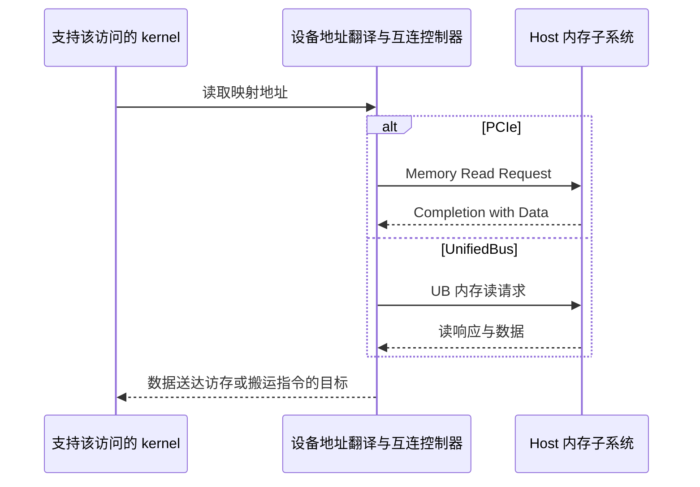

# 07 — Device 直接访问 Host 内存：PCIe、UnifiedBus 与 KV cache

[Summary](README.md) · Previous: [ACL/runtime dispatch](06_acl_runtime_dispatch.md) · Next: [Graph and software-SQ lifecycle](08_graph_and_software_sq_lifecycle.md)

分析日期：2026-09-22。源码快照：`runtime` 为 `216912472`，`driver` 为
`866e409`。本文整理 host memory mapping 的低层数据路径，并推导它对 KV cache
的适用条件。源码事实、协议层解释与性能推导分别说明；没有运行设备性能测试，
也没有验证这两个 checkout 是实际安装的配套版本。

本文的 **UB 是 UnifiedBus 互连**。AI Core 片上的 **Unified Buffer** 是另一个概念。

## 1. 注册映射与实际搬运是两个阶段

**Kernel 真正读取映射地址时，设备才通过互连向 host 请求数据。**
`aclrtHostRegister` 的 mapped-memory 用法接收现有 host allocation，建立设备可见的
地址映射，并返回 `devPtr`。它不会新建一份用户 payload，也不会在注册时把整个
buffer 复制到设备 HBM。映射所需的页表、管理对象和虚拟地址空间可以有额外分配。

普通用户页在具体映射路径中可能需要 pin；这与“API 分配了一块新的 pinned buffer”
不同。`aclrtMallocHost` 才是分配 host 内存的接口。还要区分 V2 的 PINNED 与 MAPPED
语义：当前 runtime 在 driver 不支持 pin registration 时，PINNED-only 分支只是
`InsertPinnedMemory` 登记范围，不能把这个分支描述为执行了物理 pin 操作。

源码入口：[ACL HostRegister](../../runtime/src/acl/aclrt_impl/memory.cpp#L488)、
[runtime HostRegister / V2](../../runtime/src/runtime/api/impl/api_impl.cc#L2574)。

HAL 的 `HOST_MEM_MAP_DEV_V2` 根据连接类型选择：

| 连接 | 注册实现 |
|---|---|
| UB | `svm_register_to_peer` |
| 非 UB 分支，包括 PCIe | `svm_register_pcie_th` |

证据：[HAL 分派](../../driver/src/ascend_hal/svm/v3/api/master/svm_register_only.c#L95)。

`devPtr` 表示设备地址空间中的映射地址；不能假设它与原始 host pointer 数值相同，
也不能假设它指向设备本地 HBM。

## 2. 必须按执行单元区分支持能力

当前 driver 的 host mapping capability mask 如下，仅列出本问题关心的执行单元：

| 连接类型 | AICPU | AIC | AIV |
|---|---|---|---|
| PCIe | 未列入 | 未列入 | 列入 |
| UB | 列入 | 列入 | 列入 |

证据：[连接类型能力表](../../driver/src/ascend_hal/svm/v3/api/master/svm_register_only.c#L223)。

因此，“PCIe 上 AI Core 直接访问 host”必须限定为支持该能力的执行单元/平台；
不能把 AIV 的支持扩大到 AIC。实际部署应结合 `aclrtHostMemMapCapabilities`、
注册结果和对应产品的 kernel 限制判断。

**执行单元能访问映射地址，也不等于任意现有 attention 算子接受这种地址。**
算子的地址类型、内存布局、搬运指令和 AIC/AIV 分工仍需匹配。不能仅替换 tensor
底层指针就认定标准 attention kernel 可以运行。

## 3. PCIe：从映射地址到 Memory Read TLP

### 3.1 注册时准备地址路径

对普通用户内存，非 SVA 的典型路径是：

1. 取得 host 虚拟地址对应的物理页，并 pin 住这些页。
2. 对物理页执行 DMA mapping，取得设备可使用的 DMA address segments。
3. 请求建立设备侧 `devPtr` 到这些 host 页的映射。

源码可以直接看到：

- `svm_pin_uva_npages` 固定 host 页：[pin 实现](../../driver/src/sdk_driver/svm/v3/dma_map/dma_map_core.c#L108)。
- `hal_kernel_devdrv_dma_map_page_attrs` 生成 DMA 地址并记录段列表：[DMA mapping](../../driver/src/sdk_driver/svm/v3/dma_map/dma_map_core.c#L488)。
- 注册后调用 `svm_smm_client_map`：[设备映射请求](../../driver/src/ascend_hal/svm/v3/api/master/svm_register_pcie_th.c#L392)。
- host agent 可响应设备的 DMA 地址查询，返回地址与长度段列表：[地址查询回复](../../driver/src/sdk_driver/svm/v3/pcie_th_adapt/agent/pcie_th_agent.c#L24)。这个回复是映射元数据，不是用户 payload。

**DMA mapping 不会执行一次 DMA copy。** 启用 IOMMU 时 DMA address 通常是 IOVA；
其他配置可以使用适用的总线地址，不能直接等同于 host 进程虚拟地址。

源码还存在 SVA 能力分支，可以跳过这次显式 `svm_dma_map`。这说明上述 pin/DMA-map
步骤不是所有平台唯一的实现；仅凭这里的 SVA 判断，不能继续推定具体 ATS/PASID
配置。[SVA 分支](../../driver/src/ascend_hal/svm/v3/share/pcie_adapt/svm_pcie_register_to_master.c#L18)

### 3.2 Kernel 读取时的数据路径

逻辑地址关系是：

> `devPtr + offset` → 设备地址翻译/PCIe 出口 → DMA address → host 地址翻译 → host 物理页

硬件事务过程是：

1. 支持该访问的 kernel 访存/搬运指令发出请求。
2. 设备 PCIe endpoint 发出 **Memory Read Request TLP**，携带地址、长度和请求标识。
3. 请求经 PCIe 到达 host Root Complex，由 host 内存子系统提供数据；适用时经过 IOMMU 翻译。
4. host 返回 **Completion with Data（CplD）**，payload 经 PCIe 回到设备。
5. 设备将数据交给发起访问的流水线和该指令的目标。

请求方向是 device → host，payload 方向是 host → device。正常已建立映射的访问
不需要 host CPU 为每次读取执行一个 `memcpy`。一条 kernel 指令与一个 TLP 也不是
必然一一对应：访问可能拆分，较大的读请求可以由多个 completion 返回。

这些是 PCIe 通用事务语义，不是从 host driver 推测出的 Ascend 内部 RTL。
协议参考：[PCIe requester](https://docs.amd.com/r/en-US/pg213-pcie4-ultrascale-plus/512-bit-Requester-Interface)、
[read completion boundary](https://docs.amd.com/r/en-US/pg213-pcie4-ultrascale-plus/Read-Completion-Boundary)。

## 4. UnifiedBus：跨节点的内存语义访问

### 4.1 Host 内存如何具有 UB 可访问的地址

UB 内存访问模型区分 **User**（访问者）和 **Home**（提供内存的节点）。
本场景中 NPU 是 User，拥有 buffer 的 host 是 Home。UB 支持同步的 load/store
语义访问，也支持异步 DMA；两种软件使用模型需要区分。
[openEuler 官方说明](https://docs.openeuler.org/en/docs/24.03_LTS_SP3/server/releasenotes/releasenotes/key_features.html)

仓库中明确存在的 UBMM/UBMEM 源内存映射机制包括：

1. `casm_ubmem_add_src` pin 住源 host 内存，并调用 `ubmem_map_client`。
2. `ubmm_do_map` 取得一个 UBA，底层建立 **UBA → host 物理页** 的地址翻译。
3. host 使用配置的 UB TID 初始化 UMMU translation device；映射为目标范围设置访问权限。
4. 取得 host `mem_id` 与 `uba_base`，用 `mem_id` 和 `uba - uba_base` 构造远端地址。

证据：[源内存 pin](../../driver/src/sdk_driver/svm/v3/casm_adapt/ubmem/casm_ubmem.c#L22)、
[UBA 与 mem_id 地址构造](../../driver/src/sdk_driver/svm/v3/ubmem_adapt/client/ubmem_client.c#L54)、
[TID/UMMU 初始化](../../driver/src/sdk_driver/pbl/ubmm/ubmm_map.c#L49)、
[UBA 到物理页映射](../../driver/src/sdk_driver/pbl/ubmm/ubmm_map.c#L132)。

### 4.2 Kernel 读取时的数据路径

结合上述映射实现与 UB 内存模型，概念路径是：

> kernel 映射地址 → 设备地址翻译/UB Decoder → UB 远端内存地址 → host 侧 UMMU 翻译与权限检查 → host 物理页

设备侧互连控制器把访问转换成 UB 请求，经直连链路或交换网络送到 Home。
Home 内存子系统提供数据，再通过 UB 读响应返回到设备的请求者。

**源码边界：**本次 `HostRegister` 调用链可以追到 `SVM_SMM_MMAP_EVENT` 发往设备，
但当前可见代码没有把该事件的设备处理端与上述 CASM/UBMM 机制完整串起来。
因此不能声称所有 UB `HostRegister` 配置一定经过 CASM/UBMM，也没有在这里确定
具体芯片内部的地址窗口、报文字段或 cache 路径。
[远端映射消息](../../driver/src/ascend_hal/svm/v3/share/smm_client/smm_client.c#L21)

## 5. 返回的数据是否必须先落入 HBM？



直接映射的语义不要求先把 payload 放入用户分配的一块 HBM staging buffer。
数据根据支持的指令和具体硬件进入相应的片上缓冲或其他目标，例如某条搬运指令
指定的 LocalTensor。不能从 host 侧代码进一步指定所有访问都经过哪个 cache，
或认为 Cube 计算指令可以直接把 host DRAM 当作片上操作数存储。

“Zero-copy”省掉的是显式中转复制；只要数据不在可复用的设备缓存中，读取仍需跨链路。
映射也不自动赋予 CPU/NPU 完整 cache coherence，不能省略所需的发布、等待和内存可见性操作。
解除注册或复用 buffer 前，需要结束仍可能访问它的任务。

`aclrtMemcpyAsync` 是另外一个软件动作：提交独立搬运任务。Kernel 直接读取映射
地址不要求同时调用它，也不意味着软件为每次读取提交 URMA WQE。
这不限定芯片内部可使用哪些硬件数据搬运模块。

反过来，映射成功也不证明某个 UB async memcpy 分支需要的 segment 已准备好。
Runtime 的内存分类与 driver 的传输资源资格要分别核对。
[异步 memcpy 分派与内存分类](06_acl_runtime_dispatch.md#4-async-memory-classification-comes-before-task-creation)

## 6. 大量数据与 KV cache：先区分访问次数

**PCIe 和 UB 都可以承载大块 KV 数据传输；是否适合让 attention 持续直接读 host
KV，取决于每个 decode step 的远端字节量、有效带宽和延迟预算。**
不能仅根据“可以映射”或“省去一次 memcpy”判断吞吐更好。

| 工作负载 | PCIe 建议 | UB 建议 |
|---|---|---|
| 冷 KV、空闲请求、可复用 prefix 的保存与恢复 | 适合作为容量层；按块批量异步搬运，恢复后尽量在 HBM 复用 | 同样适合；按实际拓扑比较批量搬运与直接读 |
| 持续的大块顺序流，每块只消费一次 | 批量 DMA 是性能基线；支持的 mapped kernel 也值得测量 | 批量 DMA 与 kernel 分块远端读都值得测量 |
| 每个 token 都扫描大量 host-resident KV 的 dense attention | 不宜默认作为低延迟方案；先算链路流量下限 | 有条件可行；需要有效远端读带宽足够，不能把 UB 等同于 HBM |
| 只需少量、可预测的远端 KV blocks | 比较按块预取与直接访问；避免大量串行小读 | 适合评估直接访问与预取混合，但依然受往返延迟和并发度限制 |

这些是下面流量模型导出的工程建议，不是当前 Ascend 平台的实测结果。

### 6.1 “新增 KV 很少”不代表每步只传新增 KV

对普通 dense attention，一个新 query 需要使用当前上下文的历史 K 和 V。
若历史 KV 全在 host 且设备不能跨 step 保留有效副本，每生成一个 token 都要再次
读取相应历史数据。新增 KV 的写回可以很小，历史 KV 的读入却随上下文长度增长。

对于 K/V 维度相同、每个值占 `s` bytes 的普通 MHA/GQA 存储，每条序列、每张设备
负责的 KV 数据量可由张量维度直接计算：

```text
S_KV = 2 × L × T × H_kv × D × s

L     = 该设备负责的 attention 层数
T     = 当前实际访问的历史 token 数
H_kv  = 该设备实际存放的 KV heads 数，包括必要复制
D     = 每个 head 的维度
s     = 每个 K/V 元素的存储字节数
```

张量形状参考：[Transformers cache explanation](https://huggingface.co/docs/transformers/v4.57.0/en/cache_explanation)。
这不是所有模型通用的存储公式：MLA、不同 K/V 维度、量化附加元数据、混合 attention
层和 sliding window 应按实际布局重算。TP/PP 的实际分片与复制也必须计入。

对 host 占比为 `f_host` 的 KV，假设一次普通 decode step 中每个所需 host KV 元素
仅取一次、没有设备侧可复用副本，则理想 payload 为：

```text
S_remote ≈ f_host × S_KV
t_step ≥ S_remote / B_effective
B_required ≥ S_remote × r
```

`r` 是该序列目标 tokens/s。这里的 `B_effective` 是分配给这个工作负载的有效
远端 payload 带宽，不是物理链路线速。多个独立序列共享路径时，应把各自的
`S_remote × r` 相加；共享 prefix 的跨请求读取复用需要实现支持，不能自动扣除。
重复读取、无用数据传输、页表访问和写回会增加实际开销。

### 6.2 一个与硬件型号无关的量级示例

假设一张设备负责 `L=32`、`H_kv=8`、`D=128`，KV 为 2-byte 元素，
一条序列的历史长度是 `T=32768`，全部历史 KV 在 host，每步都需要扫描：

```text
每个历史 token 的 KV = 2 × 32 × 8 × 128 × 2 = 128 KiB
整个历史 KV          = 128 KiB × 32768      = 4 GiB
20 tokens/s 所需带宽  ≥ 4 GiB × 20          = 80 GiB/s
```

以下只是代入假设有效带宽的计算，**不是 PCIe 或 UB 产品性能数字**：

| 分配给该序列的有效带宽 | 单步 4 GiB 的纯传输时间下限 |
|---|---|
| 25 GiB/s | 160 ms |
| 50 GiB/s | 80 ms |
| 100 GiB/s | 40 ms |

假设有效带宽 50 GiB/s，那么单靠重叠就无法实现此工作负载的 20 tokens/s：
每步传输下限 80 ms 已超过 50 ms 的 token 时间预算。100 GiB/s 对应 40 ms 下限，
仍不代表一定达到目标，还需要安排计算、依赖与其他通信。

HBM staging 或直接 mapped read 都必须承受这里的 host → device 必需流量。
若 staging 后能跨多个 step 保留 KV，后续流量才会降低；若每步仍需换入整个历史，
DMA 预取能改变调度与利用率，却不能消除这些字节。

### 6.3 PCIe 的具体取舍

对大块 KV 保存/恢复，优先建立 **可用于该传输路径的长期 host pool + 批量异步
copy + HBM 计算** 的基线。避免逐 token 注册/解除注册；把传输按块组织，并在有
真实独立工作的情况下预取、双缓冲和计算重叠。

直接 mapped read 更值得在“每块读一次、访问连续、可以提前发出足够多请求”的
kernel 上评估。随机、小粒度、存在串行依赖的远端读容易受往返延迟限制。
对于 N 个并发请求、每个 q bytes、平均往返延迟 RTT，一个理想并发度约束是：

```text
B_effective ≤ N × q / RTT
```

它还受链路、host DRAM、地址翻译、设备入口及竞争流量限制；大 buffer 本身
不保证请求并发足够。Mapped read 可以少一次显式 HBM staging，并且并非必然
比 DMA 慢，但需要用真实 attention 访问方式比较。

NVIDIA 对离散 GPU mapped memory 的建议也强调一次性消费与合并访问；这里只
把它作为类似架构的对照，**不将 CUDA 的 cache 行为套用为 Ascend 的硬件事实**。
[CUDA zero-copy 建议](https://docs.nvidia.com/cuda/cuda-c-best-practices-guide/#zero-copy)

对于持续扫描的活跃 dense-attention KV，默认优先在 HBM 保留工作集。Host 更适合
不活跃请求或复用前缀的容量扩展。如果 HBM 放不下、容量优先且可接受吞吐降低，
逐层/逐块 offload 仍然可以成立；不能承诺通过一次注册就保持原有 decode 性能。

### 6.4 UnifiedBus 的具体取舍

UB 的内存语义及本源码中 AIC/AIV 的访问能力，使“attention 分块直接读远端 KV”
成为值得评估的方案。它可以节省完整 HBM staging 空间，适合容量受限、远端块
可顺序读取且有足够并发的场景。

但是协议名没有给出此机器的有效带宽。需要实际测量 host DRAM/NUMA 供数能力、
每设备可用链路带宽、交换网络共享情况、UMMU/地址翻译开销以及 kernel 的请求
并发度。不能从 UB 支持 load/store 推导出 HBM 等级的带宽、延迟或一致性。

比较以下三种方案时，应保持模型语义和 KV 精度一致：

1. **Host → HBM 异步预取 → attention**：算子继续使用已支持的 HBM 输入，提前搬运块。
2. **Mapped host KV → kernel 分块读取 → 片上缓冲 → attention**：需要相应 kernel 支持；测量是否能持续提供数据。
3. **HBM 与 host 混合**：HBM 保留可复用块，host 提供剩余必需块；按模型需要预取或直接读。

“旧 KV”在 full attention 中仍可能每一步都需要，因此不能仅按时间先后把它
视为不访问的冷数据。只读取少量选定块必须由模型的精确稀疏/sliding-window 语义
或明确采用的近似算法支持；后者还需要评估质量变化。

Transformer 逐层 offload 已有预取下一层 KV 的设计；vLLM 的 prefix offload
则是把缓存块放到更大层级、命中后再恢复。这说明“活跃 KV 每步搬运”与“跨请求
prefix 保存/恢复”是不同目标，不能混用性能结论。
[Transformers offloaded cache](https://huggingface.co/docs/transformers/v5.0.0/kv_cache)、
[vLLM KV offloading](https://docs.vllm.ai/en/v0.28.0/features/kv_offloading_usage/)。
这些是外部设计参考，不是本地 CANN/vLLM-Ascend 已支持同一接口的证据。

## 7. 如何在目标机器上判断是否适用

先确定模型实际 KV 格式、每设备分片、上下文长度、并发序列数和目标 token 延迟，
按上面的公式计算最低远端流量，再比较实际实现：

| 比较项 | 应固定或记录的条件 |
|---|---|
| HBM 全驻留基线 | attention kernel、KV 精度、上下文、batch、TP/PP |
| 批量 async copy 到 HBM | 实际块大小/布局、host pool 来源、完成时间、与计算重叠的效果 |
| Kernel mapped read | 执行单元支持、地址类型、连续/跨页/实际 block-table 访问、在途请求能力 |
| 混合方案 | HBM 保留比例、每步实际远端字节数、是否有重复读取 |

测量应包括单设备与共享 host/链路时的有效 payload 带宽、每 token 延迟及 p95、
总 tokens/s 和计算等待。Copy 测量要等到传输完成，不能把异步 API 的提交耗时当作
搬运时间。注册成本单独记录，并与稳定运行阶段区分。

最终判据是：**所需远端流量在 token 时间预算内能否完成，以及容量收益是否值得
剩余性能代价。** 对 PCIe 和 UB 都应使用这个判据；两者的结论由实际平台和访问
方式决定，而不是由 `HostRegister` 或 zero-copy 的名字决定。
