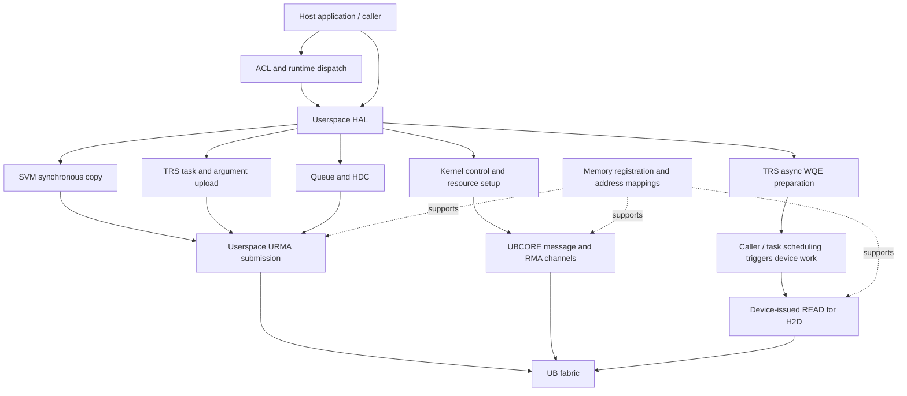

# Host-to-device paths over UB: summary and reading guide

Analysis dates: 2026-09-14–2026-09-22. Sources: the sibling `driver` checkout
at `866e409` and, for documents 06–10, `runtime` at `216912472`, clean during
their source traces. These notes describe source snapshots, rather than
measured behavior on a running device.

UB H2D consists of several paths with different transfer initiators, memory
requirements, and completion models. H2D here means any host-to-device payload
or control traffic: memory copies, task and argument uploads, queue delivery,
service requests, register updates, shared-memory access, and boot delivery.

## Scope and evidence

The focus is the Ascend 950/A5 UB implementation. Documents 01–05 cover
`driver/src/ascend_hal` and `driver/src/sdk_driver`. Document 06 connects
selected ACL actions through the 950/v200 runtime to these paths. Many data
submissions occur in the userspace HAL; resource setup and other traffic
enter the kernel.

Document 07 extends the analysis to mapped host-memory access over PCIe and
UB, and evaluates KV-cache movement using an explicit bandwidth model.
Document 08 follows the software-SQ capture-model lifecycle: recording,
finalization, upload, replay, updates, resource reclamation, and destruction.
Document 09 connects runtime 2D/batch progress to task submission and credit
reclamation, including two batch bookkeeping concerns in this snapshot.
Document 10 reviews those concerns and their cleanup paths, confirming three
host-side correctness findings and specifying the required regression coverage.

The visible tree includes host kernel code and shared/userspace implementations,
including queue receiver logic. It does not contain a complete device-side
driver or the complete external URMA/UDMA/UBCORE/UMMU stack. Statements about
missing device execution are identified as contracts or inferences. Build-time
feature selection also matters; see document 01.

Source links assume this layout:

```text
ascend_stack/
  driver/
  runtime/
  ascend_doc/
    ub_h2d/
```

Line anchors refer to this snapshot. Function names provide a second way to
locate a reference if lines move. No live runtime tracing or hardware tests
were performed. The runtime and driver checkouts have not been verified as
an installed pair. Document 06 follows source dispatch for memcpy, selected
kernel/argument launch, and queue-backed TDT send. Document 08 extends the
graph branch; service-specific and device-execution boundaries remain.

## Reading order

| Order | Document | Questions answered |
|---|---|---|
| 01 | [Transport, registration, and address mapping](01_transport_and_memory.md) | Which layer submits a transfer? What are the communication resources and memory segments? How do URMA registration and UB memory mappings differ? |
| 02 | [Synchronous and asynchronous memcpy](02_sync_and_async_memcpy.md) | Who moves H2D bytes? How do staging, direct WQEs, remote WQE preparation, 2D, and batch copies work? |
| 03 | [TRS task and argument submission](03_trs_task_and_args_submission.md) | How do arguments, SQ entries, credits, tail notification, and the host JFS doorbell relate? How do transport reports differ from task CQ reports? |
| 04 | [Queue/TDT and HDC](04_queue_and_hdc.md) | How do receiver-pull queue delivery and buffered HDC SEND differ? What do completion, backpressure, size limits, and buffer ownership mean for each? |
| 05 | [Kernel control, register access, and boot](05_control_registers_and_boot.md) | How do DMS, ESCHED, SVM messages, UB admin requests, RAO, register updates, and image delivery cross UB? |
| 06 | [ACL/runtime dispatch](06_acl_runtime_dispatch.md) | Which ACL actions select sync copy, async READ, argument WRITE, or queue pull? How do memory classification, chunking, task submission, stream completion, and recycling connect? |
| 07 | [Mapped host memory and KV cache](07_host_memory_access_and_kv_cache.md) | How do kernel reads reach host memory over PCIe and UB? Which execution units are supported? When do bulk KV transfers, direct reads, or HBM staging make sense? |
| 08 | [Graph and software-SQ lifecycle](08_graph_and_software_sq_lifecycle.md) | When are captured SQEs and WQEs uploaded? What does replay reuse? How do updates, completion, idle reclamation, and destruction differ? |
| 09 | [Runtime 2D and batch bookkeeping](09_runtime_2d_and_batch_bookkeeping.md) | How do byte and entry cursors advance? When does runtime synchronize, return WQE credits, or retain graph resources? Which batch continuation cases need correctness review? |
| 10 | [Batch correctness review](10_batch_correctness_review.md) | Which continuation concerns are confirmed by the source contracts? How does empty preparation affect CI ownership? What must a corrective patch and its tests establish? |

Documents 01–05 have been expanded into deep dives. Document 01 covers
transport setup, registration, mappings, and teardown. Document 02 traces
synchronous buffer selection and completion, TRS async preparation modes,
partial progress, and resource lifetime. Document 03 follows SQ resources,
argument/task ordering, doorbells, credits, task-report reception, and teardown.
Document 04 traces queue metadata, receiver READs, enqueue acknowledgments,
capacity retries, and cleanup, then HDC session buffers, SEND completion,
receive reposting, and teardown. It also distinguishes the supported UB APIs
and their size limits. Document 05 traces kernel message setup, SEND/reply
completion and cleanup, client service results, admin resource exchanges,
kernel register and RAO transfers, and both boot-window handoff protocols.
Document 06 connects the ordinary ACL/runtime memcpy, host-argument kernel
launch, and queue-backed tensor-send paths. It distinguishes pageable async
fallback, explicit staging, direct-WQE tasks, argument/task serialization,
and stream completion from resource recycling.
Document 07 separates registration from PCIe/UB data transactions, records
the missing device-side mapping boundary, and compares bulk KV offload with
repeated attention reads using clearly hypothetical bandwidth examples.
Document 08 traces software-SQ capture through NOP padding, first execution,
replay, task updates, idle resource reclamation, and ordinary destruction.
It also distinguishes the separate auto-split upload path.
Document 09 follows UB 2D/batch dispatch, pageable fallback, metadata
compaction, partial preparation, task submission, and completion-driven
CI return. It separates the connected source path from unresolved batch
continuation behavior.
Document 10 confirms the two progress-counter defects and identifies the
related empty-preparation credit-ownership defect. It records remediation
requirements and the gaps in existing mocked tests; runtime fixes remain open.

## Follow-up status

“Covered” below means the selected host source path is connected; it does
not mean the device protocol has been validated on hardware.

| Work item | Status |
|---|---|
| Ordinary ACL/runtime dispatch and resource lifetime | Covered for the selected paths in 06 |
| PCIe/UB mapped host access and KV-cache tradeoffs | Covered in 07, with explicit device-side mapping and measurement gaps |
| Software-SQ capture, finalization, first upload, replay, updates, idle reclamation, ordinary destruction | Covered in 08 for the 950/v200 UB capture-model path |
| Auto-split variants and nested conditional/external-event edge cases | Main auto-split upload selector compared in 08; full lifecycle variants remain |
| Runtime 2D/batch progress and completion bookkeeping | Source trace covered for the selected UB H2D/D2H paths in 09; HAL mechanics are in 02 |
| Batch continuation correctness | Source review complete in 10: B1 per-call count comparison, B2 discarded byte-only continuation, and B3 empty-preparation CI ownership are confirmed host-code defects; fixes and behavioral validation remain |
| Legacy TDT and service-specific HDC/device application behavior | Remaining source follow-up |
| Device scheduling, coherency, failure quiescence, and measured performance | Require additional implementation/interface evidence or hardware validation |

## Path inventory

The rows identify distinct software paths. Several share the same lower-level
SEND or READ/WRITE implementation; they are not ten independent physical links.

| ID | Path and entry points | Transfer and completion model | Detail |
|---|---|---|---|
| P1 | Synchronous memory copy: `drvMemcpy`, `halMemcpy`, `halMemcpy2D`, `halMemcpyBatch` | Host submits URMA WRITE for H2D and waits for completion. Ordinary host memory can use a staging pool or temporary registration. | 02 |
| P2 | Stream-oriented async copy: `halAsyncDmaCreate*`, `halAsyncDmaWqeCreate`, WQE conversion/jetty interfaces | Host prepares device-side READ work for H2D, including SQE-update destinations. Preparation and task execution are separate. Supports direct WQEs and remote WQE preparation. | 02 |
| P3 | Normal task submission: `halSqTaskSend` | Host posts an ordered chain of SQ-entry and device-tail WRITEs, then rings the local JFS doorbell to trigger it. | 03 |
| P4 | Argument upload: `halSqTaskArgsAsyncCopy` | Queues host-issued WRITEs on the SQ-associated JFS, without ringing its doorbell in this function. A subsequent task submission can trigger the queued work. | 03 |
| P5 | Queue/TDT enqueue: `halQueueEnQueueBuff` and remote queue machinery | Host sends buffer metadata. Receiver READs the payload and sends an acknowledgment. Queue state and backpressure are part of the operation. | 04 |
| P6 | HDC normal send: `halHdcSend` and `hdc_ub_send` | Copies application bytes into a registered session buffer, posts URMA SEND, and handles transport completion. Session control uses the kernel. | 04 |
| P7 | Remote events and service requests: ESCHED and TRS/SVM event helpers | Remote ESCHED requests use kernel common messages. Some queue notifications instead travel as topic SQ tasks. | 05, 03 |
| P8 | DMS/URD and kernel module messages | Common or dedicated channels submit kernel SEND requests and process replies. UB admin requests establish and manage resources. | 05 |
| P9 | Register and shared-status access: `devdrv_urma_copy`, RAO helpers | Registered kernel buffers and imported remote segments support READ/WRITE. H2D examples include TRS register updates and management shared-status writes. | 05 |
| P10 | Boot/image delivery | Host fills a buffer, grants device read access through UMMU/SVA, and publishes address/TID/size through BIOS mailbox or UBIOS callback flows. Device pull is the exposed contract; the actual reader is outside this host code. | 05 |

Task-storage helpers can reuse other rows: the conditional high-performance
`halStreamTaskFill` path copies through P1, while async SQE updates use P2.
Document 03 distinguishes these from normal P3 task submission. Document 08
connects their use in captured task upload, replay, and kernel-SQE updates.
Document 09 connects P2's 2D/batch partial preparation to runtime task cleanup
and the HAL's caller-supplied CI updates.

Shared-memory access is an additional mode spanning the inventory: UBMM/UBMEM
can expose host pages through a UB address mapping, while eligible mappings can
support CPU load/store access. Creating a mapping does not itself copy a payload.
Document 01 separates this mode from URMA data submissions. Document 07 covers
kernel-originated mapped reads and their PCIe/UB capability restrictions.

## Architecture at a glance



The arrows show software responsibility, not a literal packet route. Userspace
submission still relies on kernel-created resources, page lifetime management,
and the installed UB stack. The boot path has its own early initialization
contract and is covered separately.

## Distinctions that guide the detailed analysis

1. **Payload direction and operation direction differ.** A host WRITE and a
   device READ both carry H2D bytes. SVM sync copy selects WRITE, whereas TRS
   async copy selects READ for H2D.
2. **Preparation, submission, and execution differ.** Constructing a WQE,
   posting it to a JFS, ringing the JFS doorbell, and completing a device task
   are separate events.
3. **Completion has several owners.** URMA transfer completion, a queue ACK,
   service-reply completion, and device task completion have different meanings.
4. **Memory setup is part of the path.** Managed host memory, temporary
   registration, staging buffers, imported remote segments, and mapped shared
   memory have different lifetimes and costs.
5. **A familiar API name does not establish UB support.** The SVM UB copy table
   leaves the older async/descriptor hooks empty. TRS supplies separate async
   interfaces. HDC FastSend explicitly rejects UB.

Starting evidence: [SVM UB copy operations](../../driver/src/ascend_hal/svm/v3/op/ub_adapt/svm_ub_memcpy.c#L446),
[TRS H2D opcode](../../driver/src/ascend_hal/trs/core/urma/master/trs_master_async.c#L309),
[TRS post and doorbell](../../driver/src/ascend_hal/trs/core/urma/master/trs_master_urma.c#L912),
[UB kernel operation table](../../driver/src/sdk_driver/comm/ub/host/ascend_ub_main_adapt.c#L740).

## Boundaries of the inventory

- Device-to-device collective traffic in HCCL/HCOMM is outside this H2D driver
  analysis. D2D branches encountered in shared functions are identified where
  needed to avoid mistaking them for H2D.
- A device-local memcpy or memset request can send an H2D control message
  without sending its entire result over the host link.
- UDIS information collection and many diagnostic bulk reads are D2H uses of
  shared helpers, rather than additional H2D upload mechanisms.
- PCIe-specific DMA descriptor construction, `asdrv_queue` payload enqueue,
  and VNIC must not be assumed active merely because their modules exist in a
  UB-capable build. Relevant selectors are recorded in the detail documents.
- Runtime stream-wait and task-recycling entry points are connected in document
  06; graph completion references and resource ownership are traced in 08.
  Exact device report semantics, memory-coherency guarantees, performance,
  and recovery quiescence require external implementation or hardware evidence.

## Related documents

This series adds UB detail alongside the existing analyses:

- [Queue subsystem, TDT, and PCIe versus UB](../queue_subsystem_host_driver_tdt_and_ub.md)
- [Buffer subsystem and XSMEM](../buff_subsystem_xsmem_shared_memory.md)
- [DMS, URD dispatch, and the control plane](../dms_subsystem_urd_dispatch_and_control_plane.md)

The earlier documents provide subsystem context. The numbered documents here
are grounded in the source revision recorded above and distinguish host-visible
facts from device-side contracts.
